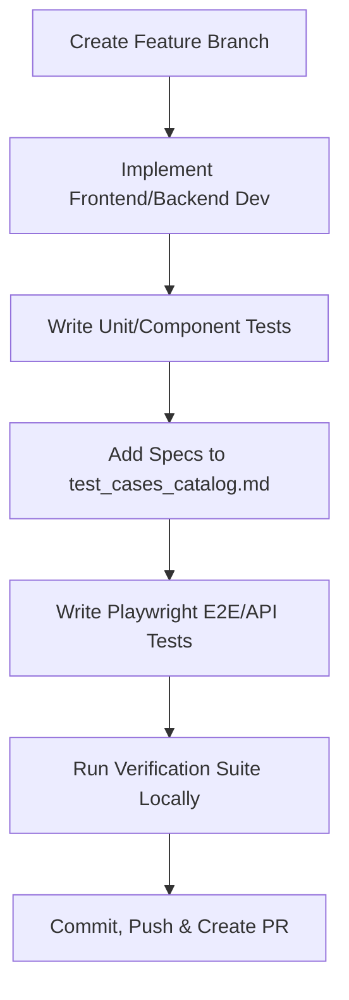

# 🤖 BuggyBooks Agent Development & QA Rules

This document outlines the workflow, architecture conventions, and test rules that all AI assistants must follow when modifying the BuggyBooks codebase or writing automation suites.

---

## 🔄 Core Workflow Rules

Every development or QA task must strictly follow this lifecycle:

1. **Branch Isolation**:
   * **NEVER** modify code directly on `main`.
   * Create a branch matching `feature/<name>`, `bugfix/<name>`, or `test/<name>`.

2. **Feature Implementation**:
   * Maintain architecture patterns: Express controllers, models, and JSON stores in `/backend`; React, TypeScript, HSL design system, and custom styling in `/frontend`.

3. **Multi-Tier Testing Hierarchy**:
   * **Backend Logic**: Write Jest unit tests in the `/backend` directory.
   * **Frontend UI Component Logic**: Write Vitest + React Testing Library tests in `/frontend`. Use **Mock Service Worker (MSW)** in `src/mocks/server.ts` to mock API endpoints in component tests. Do not call live backend services in component unit tests.
   * **E2E/API Integration Logic**: Write Playwright tests in `playwright-e2e`.

4. **Test Catalog Synchronization**:
   * Prior to writing E2E code, append new test definitions to [test_cases_catalog.md](file:///c:/BuggyBooks/buggy-books/specs/test_cases_catalog.md).
   * Specify: ID, Title, Description, Priority, Target Coverage, and Status.

5. **Playwright Spec Naming & Structure**:
   * Place specs under `playwright-e2e/src/tests/` matching their categories: `ui/` or `api/` (e.g. `UserManagement/`, `BookCatalog/`, `Checkout/`, `CartAndInventory/`, `ChaosAndTesting/`).
   * Test files must follow the format `Test_00X_<FeatureName>.spec.ts` (using 3-digit serial numbering).
   * If `USE_SPECIFIC_TESTS` is active, register the test path in [playwright.config.ts](file:///c:/BuggyBooks/buggy-books/playwright-e2e/src/config/playwright.config.ts).

6. **Test Isolation & Reset Handling**:
   * E2E/API test suites must perform a state reset using `POST /api/test/reset` in `beforeEach` and `afterAll` hooks to maintain test isolation and prevent database state leaks.

7. **Local Verification Checklists**:
   * Compile and build code without TypeScript warnings.
   * Verify all Jest/Vitest tests pass (`npm run test` or `npm test`).
   * Verify Playwright tests pass by running local dev servers (`npm run dev`).

8. **Deployment & Pull Request Policy**:
   * Push the final code to the remote repository.
   * Open a PR so that the continuous integration (CI) pipeline runs verification tests against GitHub Actions before merging to `main`.
