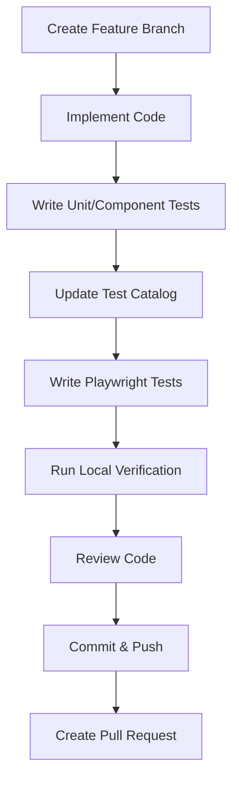

# 🤖 BuggyBooks AI Development & QA Guidelines

This document defines the mandatory workflow, architecture standards, testing strategy, and quality gates that every AI agent must follow when contributing to the BuggyBooks codebase.

Failure to follow these rules results in an incomplete implementation.

---

# Guiding Principles

Every change must satisfy these objectives:

- Keep changes minimal and scoped to the requested task.
- Preserve existing architecture and coding conventions.
- Never introduce untested functionality.
- Ensure all affected documentation remains synchronized.
- Leave the repository in a releasable state.

---

# Development Lifecycle

Every feature, bug fix, refactor, or test implementation must follow this workflow.



No step may be skipped.

---

# 1. Branch Policy

AI agents **must never** modify `main` directly.

Create one of the following branches:

```text
feature/<feature-name>
bugfix/<bug-name>
test/<feature-name>
refactor/<area-name>
```

Each branch should contain a single logical change.

---

# 2. Architecture Rules

Maintain existing project architecture.

## Backend

Located in:

```text
/backend
```

Use:

- Express controllers
- Models
- Services (if applicable)
- JSON data stores

Avoid introducing new architectural patterns unless explicitly requested.

## Frontend

Located in:

```text
/frontend
```

Use:

- React
- TypeScript
- Existing HSL design system
- Existing styling conventions

Do not introduce additional UI frameworks or styling libraries.

---

# 3. Testing Strategy

Every code change must include appropriate automated tests.

## Backend

Framework:

- Jest

Location:

```text
/backend
```

Test:

- Business logic
- Controllers
- Utilities
- Services

## Frontend Component Tests

Frameworks:

- Vitest
- React Testing Library

API mocking:

```text
src/mocks/server.ts
```

Requirements:

- Use Mock Service Worker (MSW)
- Never call live backend services
- Verify rendering
- Verify user interactions
- Verify error states
- Verify loading states

## Playwright Integration Tests

Location:

```text
playwright-e2e/src/tests/
```

Purpose:

- End-to-end UI flows
- API integration
- Cross-layer validation

---

# 4. Test Case Catalog

Before creating a Playwright test, update:

```text
specs/test_cases_catalog.md
```

Each entry must include:

- Test ID
- Title
- Description
- Priority
- Coverage Area
- Status

Documentation must remain synchronized with implementation.

---

# 5. Playwright Organization

Store tests using the existing feature structure.

```text
playwright-e2e/
└── src/
    └── tests/
        ├── ui/
        │   ├── UserManagement/
        │   ├── BookCatalog/
        │   ├── Checkout/
        │   └── CartAndInventory/
        └── api/
            └── ChaosAndTesting/
```

File naming convention:

```text
Test_001_Login.spec.ts
Test_002_Checkout.spec.ts
Test_003_CreateBook.spec.ts
```

Always use a three-digit sequence.

If `USE_SPECIFIC_TESTS` is enabled, register the new spec in:

```text
playwright.config.ts
```

---

# 6. Test Isolation

Every Playwright suite must reset application state.

Required:

```text
beforeEach
    POST /api/test/reset

afterAll
    POST /api/test/reset
```

Tests must never depend on execution order or previously created data.

---

# 7. Local Verification

Before committing, verify:

## Build

- TypeScript compiles successfully
- No build errors
- No TypeScript warnings

## Unit Tests

Run:

```bash
npm test
```

or

```bash
npm run test
```

All tests must pass.

## Playwright

- Start local development servers.
- Execute the relevant Playwright suites.
- Ensure all tests pass.

---

# 8. Code Quality Review

Before committing:

Remove:

- Debug code
- Temporary files
- `console.log` statements
- Commented-out code
- Unused imports
- Unused variables

Verify:

- Formatting
- Lint compliance
- Consistent naming
- Readable code
- Meaningful comments where business logic is non-obvious

Avoid unnecessary refactoring outside the requested scope.

---

# 9. Documentation Synchronization

Whenever behavior changes, update any affected documentation, including:

- `specs/test_cases_catalog.md`
- README files
- API documentation
- Developer guides
- Architecture documentation

Documentation should reflect the implementation at the time of the commit.

---

# 10. Pull Request Requirements

Before opening a PR:

- All local tests pass.
- Documentation is updated.
- No unrelated files are modified.
- Changes are reviewed for correctness.
- CI is expected to pass without additional fixes.

Push the feature branch and create a Pull Request.

Merge only after successful GitHub Actions validation.

---

# 11. Prohibited Actions

AI agents must **not**:

- Modify `main` directly.
- Bypass failing tests.
- Skip writing required tests.
- Disable existing tests to make CI pass.
- Remove functionality unless explicitly requested.
- Introduce unrelated refactoring.
- Commit secrets, credentials, or API keys.
- Leave TODOs as a substitute for implementation.
- Modify generated files unless explicitly required.

---

# Definition of Done

A task is complete only when all of the following are true:

- Code implementation is complete.
- Unit/component tests are added.
- Playwright tests are added where applicable.
- Test catalog is updated.
- Documentation is synchronized.
- All local verification passes.
- Code review checklist is satisfied.
- Changes are committed to a feature branch.
- A Pull Request is ready for CI validation.
