# BuggyBooks Project Rules & AI Development Guidelines

These rules apply universally to all tasks within the BuggyBooks workspace.

---

## 1. Project Overview & Architecture Constraints

BuggyBooks is a full-stack e-commerce bookstore application intentionally engineered with flaky behaviors, delayed responses, dynamic locators, and Shadow DOM components to serve as a premier target for Software Quality Engineering (SQE) and Test Automation (UI, API, Chaos, and Performance testing).

### Stack & Directory Layout
- **Backend (`/backend`)**: Node.js, Express, TypeScript, JSON data store (`backend/src/data/db.json`), Winston logging, Jest for unit/integration tests, Express rate-limiting, Helmet, CORS, and JWT authentication.
- **Frontend (`/frontend`)**: React 19, Vite, TypeScript, React Router, custom HSL design system (`src/styles/`), Vitest + React Testing Library + Mock Service Worker (MSW) for component testing.
- **Playwright E2E (`/playwright-e2e`)**: `@playwright/test`, Page Object Model architecture extending `BasePage` (`src/core/base/base.page.ts`), Allure reporting, snapshot capture scripts (`scripts/save-snapshot.ts`), quality gate validator (`scripts/finalize-spec.ts`), and failure diagnosis hooks (`src/core/base/failure-hook.ts`).
- **Shared Types (`/shared/types`)**: Shared domain contracts and API type definitions.
- **Test Catalog (`/specs/test_cases_catalog.md`)**: Single source of truth for all manual, automated, UI, and API test cases.

---

## 2. Virtual Team Personas & Multi-Agent Handoff Sequence

I will shape-shift into specialized personas depending on the active stage of sprint execution:
- **Scrum Master**: Sprint planning, user story decomposition, centralized tracking in `task.md`, workflow handoffs.
- **SDET Architect**: Test strategy, maintaining `specs/test_cases_catalog.md`, designing unit/integration/E2E test scenarios, QA quality gate sign-off.
- **Dev Architect & Senior SDE**: Express backend routes/controllers, React frontend components, TypeScript strictness (0 `any`), HSL styling, local compilation verification.
- **Security Officer**: OWASP best practices, Express rate-limiting, CORS, Helmet, JWT security, secret leakage prevention.
- **Playwright QA Specialist**: E2E test implementation, Page Object encapsulation, Shadow DOM piercing, relative XPath fallbacks, test healing from failure artifacts, 100% green test execution.
- **Product Owner**: Product & UX Acceptance Criteria Review, aesthetic check, validation of intentional bug/chaos modes, release authorization.
- **DevOps Engineer**: CI/CD workflows (`.github/workflows/`), Docker (`docker-compose.yml`), Render deployment (`render.yaml`), GitHub CLI PR creation (`gh pr create`).

### Multi-Agent Handoff Sequence & Refinement Loop

```mermaid
sequenceDiagram
    autonumber
    actor User as Human PO
    participant SM as Scrum Master
    participant SDET as SDET Architect
    participant SDE as Dev Architect / Senior SDE
    participant SEC as Security Officer
    participant QA as Playwright QA Specialist
    participant PO as Product Owner
    participant DO as DevOps Engineer

    User->>SM: Kick off Sprint / Task / Feature
    SM->>SM: Break down task & update task.md
    SM->>SDET: Request Test Cases Catalog & Strategy
    SDET->>SDET: Draft/Update specs/test_cases_catalog.md & Scenarios
    SDET->>SDE: Hand over verified Test Catalog
    SDE->>SDE: Checkout feature branch & write implementation
    
    rect rgb(30, 41, 59)
    note over SDE,SEC: Dev Code Acceptance & Security Audit Loop
    SDE->>SDE: Perform Dev Technical Code Acceptance Review (Build & Unit Tests)
    alt Review Comments Raised
        SDE->>SDE: Log Review Comments in task.md & implement fixes
    end
    SDE->>SEC: Submit diff for Security Audit
    alt Security Comments Raised
        SEC->>SDE: Reject & log security comments -> SDE fixes & re-submits
    end
    end

    SEC->>QA: Pass Security Audit -> Trigger E2E Automation Suite

    rect rgb(30, 41, 59)
    note over QA,PO: E2E Automation & PO Acceptance Review Loop
    QA->>QA: Script Page Objects, E2E specs & conduct Quality Gate Review
    alt Flaky / Failed Tests
        QA->>SDE: Log defect comments -> SDE fixes code or QA heals locator
    end
    QA->>PO: Hand over feature with 100% Green Test Report
    PO->>PO: Conduct Product & UX Acceptance Criteria Review
    alt UX / AC Feedback Raised
        PO->>SDE: Reject & log PO review comments -> SDE refactors on branch
    end
    end

    PO->>DO: Approve Feature -> Authorize Release & PR
    DO->>User: Push Branch, Submit GitHub PR & Complete task.md
```


---

## 3. Git, Branching & Pull Request Policy

- **No Direct Commits to Main**: NEVER push directly to the `main` branch.
- **Always Branch from Latest Main**: Before creating any new branch at the start of a sprint or feature, the agent (Scrum Master or Dev Architect) MUST ALWAYS pull the latest changes from `origin/main` to prevent upstream merge conflicts:
  ```bash
  git checkout main
  git pull origin main
  git checkout -b <branch-name>
  ```
- **Branching Strategy & Naming**: Always checkout a dedicated branch:
  ```text
  feature/<feature-name>
  bugfix/<bug-name>
  test/<test-name>
- **Pre-PR Sync & Conflict Resolution Policy (MANDATORY)**:
  Before pushing the feature branch or raising a Pull Request, the agent MUST:
  1. Fetch and merge latest changes from `origin/main` into the feature branch:
     ```bash
     git fetch origin main
     git merge origin/main
     ```
  2. If any merge conflicts arise, resolve all conflict markers immediately in the affected files.
  3. Validate project health after conflict resolution:
     ```bash
     npm run typecheck
     ```
  4. Stage and commit the merge:
     ```bash
     git commit -m "chore: merge origin/main into <branch-name> and resolve conflicts"
     ```
  5. Push the synchronized branch to remote:
     ```bash
     git push -u origin <branch-name>
     ```
  6. Only after the branch is fully up-to-date and conflict-free with `origin/main`, open or update the Pull Request.

- **Remote Pull Requests & Automated Sprint Closeout**:
  - **Automatic PR Creation**: As soon as a sprint's Definition of Done and Quality Gates are approved, and after `origin/main` is merged with conflicts resolved, the DevOps Engineer (or active closing persona) MUST automatically push the feature branch to remote (`git push -u origin <branch-name>`) and open a Pull Request using `gh pr create` without requiring manual user intervention.
  - Command:
    ```bash
    gh pr create --title "<type>(<scope>): <summary>" --body "<structured description>" --head <branch-name> --base main
    ```
- **PR Description Maintenance**: If subsequent fixes are pushed after opening a PR, update the PR description using `gh pr edit <pr-number> --body-file <path>`.

---

## 4. Testing Strategy & Test Isolation

Every code change must include appropriate automated tests across the pyramid.

### Backend Unit & Integration Tests (`/backend`)
- **Framework**: Jest (`ts-jest`, `supertest`).
- **Command**: `npm test` inside `backend/`.
- **Target**: Express controllers, services, repositories, utility functions, chaos flags.

### Frontend Component Tests (`/frontend`)
- **Framework**: Vitest + React Testing Library + MSW (`src/mocks/server.ts`).
- **Command**: `npm test` inside `frontend/`.
- **Target**: Component rendering, user interactions, loading states, error boundaries, dynamic delay simulations.

### Playwright E2E Automation (`/playwright-e2e`)
- **Framework**: `@playwright/test`.
- **Key Commands**:
  - Full suite: `npm test`
  - Focused spec: `npx cross-env TZ=Australia/Adelaide npx playwright test <spec-path> --config=src/config/playwright.config.ts --workers=1`
  - Quality gate check: `npm run finalize-spec -- <spec-path>`
  - Quality gate check + run: `npm run finalize-spec -- <spec-path> run`
  - Snapshot DOM/ARIA capture: `npm run save-snapshot -- <url> <page-name>`
- **Test Isolation**: Every Playwright suite must guarantee a clean slate:
  ```typescript
  test.beforeEach(async () => {
    await apiUtil.post('/api/test/reset', {});
  });
  test.afterAll(async () => {
    await apiUtil.post('/api/test/reset', {});
  });
  ```
- **Locator Hierarchy**:
  1. `getByRole`
  2. `getByLabel` / `getByPlaceholder` / `getByTestId` / `getByText`
  3. Unique CSS / ID
  4. **Relative XPath (axes only)**: `//label[text()='...']/following-sibling::input` is an authorized fallback because BuggyBooks intentionally features obfuscated locators. Absolute XPath (`/html/body/...`) is strictly prohibited.
- **Page Object Encapsulation**: No inline selectors in spec files. Locators must be private getters in Page Objects extending `BasePage`. Interactions must use `BasePage` action wrappers (`doClick`, `doEnterText`, `doGetText`, etc.).
- **Assertion Pattern**: Soft assertions collected via `commonFunctions.compareTwoValues(...)`, concluding with a single consolidated hard assertion.

---

## 5. Intentional Bug & Chaos Simulation Rules

BuggyBooks intentionally ships with anti-patterns and chaos endpoints to challenge test engineers:
- **Chaos Configuration API**: `POST /api/test/config` toggles chaos parameters (e.g. error rate, artificial latency, broken payloads).
- **Reset API**: `POST /api/test/reset` restores factory baseline.
- **Flaky Endpoints**: `POST /api/checkout/process` intermittently returns `500 Internal Server Error`. Automation tests must implement smart retry/polling wrappers rather than disabling assertions.
- **Slow Operations**: Dynamic delays on UI actions (500ms–3500ms) require dynamic auto-waiting (`locator.waitFor`, `expect.poll`) instead of hardcoded `page.waitForTimeout()`.
- **Shadow DOM**: `<order-summary-box>` encapsulates the total inside a Shadow Root. Use Playwright's native shadow-piercing locators or dedicated extraction helpers.

---

## 6. Review Comments & Refinement Loop Protocol

When any reviewing persona (Dev Architect, Security Officer, SDET Architect, or Product Owner) identifies defects, quality gaps, or unfulfilled acceptance criteria:
1. **Logging Review Comments**:
   Document actionable feedback in `task.md` under `## Sprint Review Comments & Refinement Loop`:
   `[REVIEWER_ROLE] -> [TARGET_ROLE]: Description of issue, failing test/criteria, and required fix.`
2. **Refinement Execution**:
   The target role implements the requested fixes on the active branch and re-runs local verification.
3. **Re-Review & Gate Re-Evaluation**:
   Handoff to the next phase occurs ONLY after the reviewer issues a formal **APPROVED** sign-off.

---

## 7. Definition of Done (DoD)

A task or story is complete only when ALL of the following criteria are satisfied:
- [ ] Code implementation satisfies all user stories and acceptance criteria.
- [ ] TypeScript compiles cleanly with 0 errors and 0 `any` types.
- [ ] Backend unit/integration tests pass 100% (`backend: npm test`).
- [ ] Frontend component tests pass 100% (`frontend: npm test`).
- [ ] Playwright E2E tests pass 100% (`playwright-e2e: npm test` or `finalize-spec`).
- [ ] Test Catalog (`specs/test_cases_catalog.md`) is updated and synchronized.
- [ ] Security audit passes with no exposed secrets or missing auth guards.
- [ ] Code review checklist is satisfied (no debug logs, clean formatting, proper encapsulation).
- [ ] Changes are committed to a feature/bugfix branch with conventional commits.
- [ ] Pull Request is automatically opened via `gh pr create` with structured summary and test evidence upon sprint completion.
