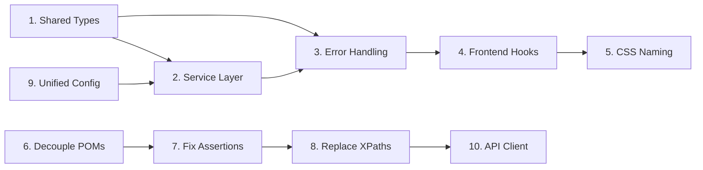

# BuggyBooks — Senior Principal Architect Review: Top 10 Architecture Improvements

> **Scope**: Full-stack review of [backend](file:///c:/BuggyBooks/buggy-books/backend/src), [frontend](file:///c:/BuggyBooks/buggy-books/frontend/src), and [playwright-e2e](file:///c:/BuggyBooks/buggy-books/playwright-e2e/src) layers.
> Focus: Patterns, structure, cleanliness, maintainability, and scalability.

---

## Executive Summary

The codebase is functional and ships value, but suffers from several recurring structural anti-patterns that will compound as the project grows. The most critical issues are: **absence of a shared type system**, **missing service/repository layer in the backend**, **duplicated type definitions across frontend components**, **inconsistent CSS class naming**, **Playwright POM pages instantiating each other (tight coupling)**, and **duplicate assertion patterns in E2E tests**. Below are the top 10 improvements, ordered by impact.

---

## 🔴 MUST-DO Improvements (Critical)

---

### 1. Extract Shared TypeScript Types into a `types/` Package [COMPLETED]

**Layer**: Cross-cutting (Backend + Frontend + Playwright)
**Severity**: 🔴 Critical
**Problem**: The `Book` interface is defined **4 separate times** in 4 different files with subtle field differences:

| Location | Fields |
|---|---|
| [dataStore.ts](file:///c:/BuggyBooks/buggy-books/backend/src/data/dataStore.ts#L3-L11) | `id, title, author, price, image, genre?, description?` |
| [Catalog.tsx](file:///c:/BuggyBooks/buggy-books/frontend/src/pages/Catalog.tsx#L7-L14) | `id, title, author, price, image, genre?` (missing `description`) |
| [Cart.tsx](file:///c:/BuggyBooks/buggy-books/frontend/src/pages/Cart.tsx#L6-L10) | `id, title, price` only |
| [ChaosConfig](file:///c:/BuggyBooks/buggy-books/frontend/src/ChaosContext.tsx#L3-L11) vs [chaosStore.ts](file:///c:/BuggyBooks/buggy-books/backend/src/data/chaosStore.ts#L3-L11) | Same structure, defined twice |

**Status**: Completed. Defined canonical types in `shared/types` and set up TS path mappings across all components.

---

### 2. Backend: Introduce a Service Layer (Separate Business Logic from Controllers) [COMPLETED]

**Layer**: Backend
**Severity**: 🔴 Critical
**Problem**: Controllers directly contain business logic, data access, validation, and response formatting. The [authController.ts](file:///c:/BuggyBooks/buggy-books/backend/src/controllers/authController.ts) is 142 lines and handles JWT creation, bcrypt hashing, cookie setting, user lookup, chaos config reads — all in one file with no separation.

**Status**: Completed. Introduced `UserRepository` to wrap state storage, extracted all core business logic out of controllers into standalone `AuthService`, `BookService`, `CartService`, `CheckoutService`, and `ProfileService`, and simplified controllers to focus only on handling requests and responses.

---

### 3. Backend: Centralized Error Handling with Custom Error Classes [COMPLETED]

**Layer**: Backend
**Severity**: 🔴 Critical
**Problem**: Every controller manually catches errors and sends `res.status(4xx).json(...)`. This is repeated ~15 times across controllers. The [error handler in app.ts](file:///c:/BuggyBooks/buggy-books/backend/src/app.ts#L87-L100) exists but controllers short-circuit before reaching it. Zod errors are caught individually in [cartController](file:///c:/BuggyBooks/buggy-books/backend/src/controllers/cartController.ts#L29-L36), [checkoutController](file:///c:/BuggyBooks/buggy-books/backend/src/controllers/checkoutController.ts#L47-L54), and [testController](file:///c:/BuggyBooks/buggy-books/backend/src/controllers/testController.ts#L22-L27).

**Status**: Completed. Introduced custom AppError classes, async wrapper middleware, global Express error handler, and refactored all controllers to throw errors instead of handling them inline.

---

### 4. Frontend: Establish a Proper Component Architecture with Hooks Separation

**Layer**: Frontend
**Severity**: 🔴 Critical
**Problem**: Pages contain inline data fetching, state management, validation logic, and rendering — all in one file. [Checkout.tsx](file:///c:/BuggyBooks/buggy-books/frontend/src/pages/Checkout.tsx) is **365 lines** with 7 `useState` calls, 2 validation functions, a dirty-state tracker, `beforeunload` listeners, form submission, and the entire multi-step wizard UI.

[Profile.tsx](file:///c:/BuggyBooks/buggy-books/frontend/src/pages/Profile.tsx#L4) also directly uses `fetch()` instead of the [centralized api.ts](file:///c:/BuggyBooks/buggy-books/frontend/src/api.ts) wrapper — bypassing the token refresh interceptor entirely.

**Impact**: Untestable logic. Inconsistent API call patterns. Growing page components become unmaintainable.

#### Implementation Steps

1. **Create** `frontend/src/hooks/` directory:
   - `useBooks.ts` — encapsulates book fetching, pagination, search state
   - `useCart.ts` — encapsulates cart CRUD operations
   - `useCheckout.ts` — encapsulates wizard state, validation, submission
   - `useProfile.ts` — encapsulates profile fetch and avatar upload
2. **Add** profile endpoints to [api.ts](file:///c:/BuggyBooks/buggy-books/frontend/src/api.ts) (currently missing `getProfile` and `uploadAvatar`)
3. **Extract** checkout validation into `frontend/src/utils/validators.ts`
4. **Break** Checkout.tsx into sub-components:
   - `CheckoutWizard.tsx` (orchestrator)
   - `ShippingStep.tsx`
   - `PaymentStep.tsx`
   - `ConfirmStep.tsx`
   - `WizardStepper.tsx` (progress bar)
5. **Establish** rule: Pages are **composition roots** (assemble components + hooks); Components are **pure rendering**; Hooks encapsulate **state + side effects**

---

### 5. Frontend: Normalize CSS Class Naming Convention

**Layer**: Frontend
**Severity**: 🔴 Must-Do
**Problem**: CSS class names are a chaotic mix of naming conventions with no consistency:

| Pattern | Examples | Files |
|---|---|---|
| Random suffixed | `layout-wrapper-xyz987`, `complex-item-box-alpha`, `image-cell-omega`, `info-cell-beta` | [Catalog.tsx](file:///c:/BuggyBooks/buggy-books/frontend/src/pages/Catalog.tsx#L117-L129) |
| Random numbered | `input-group-rnd-9182`, `form-container-xyz`, `action-btn-primary dynamic-l1` | [Checkout.tsx](file:///c:/BuggyBooks/buggy-books/frontend/src/pages/Checkout.tsx#L188-L193) |
| Semantic BEM-ish | `auth-card`, `auth-input`, `auth-submit-btn`, `cart-list`, `cart-item` | [Login.tsx](file:///c:/BuggyBooks/buggy-books/frontend/src/pages/Login.tsx), [Cart.tsx](file:///c:/BuggyBooks/buggy-books/frontend/src/pages/Cart.tsx) |
| Obfuscated | `title-variant-2`, `author-meta-tag`, `price-tag-value`, `lbl-t1`, `submit-action-btn primary-x2` | Various |

> [!IMPORTANT]
> I understand that some of this obfuscation is **intentional** for the "BuggyBooks" QA testing practice app — the randomized names/IDs exist to challenge testers. If that is the case, this item should be **documented clearly** (e.g., in a `CONTRIBUTING.md` or `ARCHITECTURE.md`), and the "QA-challenge" classes should be separated from the "real design system" classes via a naming convention (e.g., prefix intentionally tricky selectors with `qa-` or `chaos-`).

#### Implementation Steps

1. **Decide** on a naming convention: BEM (`block__element--modifier`) or component-scoped (CSS Modules)
2. **Create** `frontend/src/styles/` directory with partials: `_variables.css`, `_base.css`, `_components.css`, `_pages.css`
3. **Refactor** the 28KB monolithic [index.css](file:///c:/BuggyBooks/buggy-books/frontend/src/index.css) into organized partials
4. **Rename** classes following the chosen convention, documenting any intentionally obfuscated names for the QA testing purpose
5. **Co-locate** component-specific styles: `components/NotificationCenter/NotificationCenter.css`

---

## 🟡 GOOD-TO-HAVE Improvements (High Value)

---

### 6. Playwright: Decouple Page Objects — Remove Cross-POM Instantiation

**Layer**: Playwright E2E
**Severity**: 🟡 High
**Problem**: Page Objects instantiate **other** Page Objects, creating tight coupling and violating the Single Responsibility Principle:

- [SignUpPage.login()](file:///c:/BuggyBooks/buggy-books/playwright-e2e/src/pages/signup-login.page.ts#L85-L91) creates `new CatalogPage(this.page)` internally and calls `catalogPage.verifyCheckoutPage()`
- [SignUpPage.registerNewUser()](file:///c:/BuggyBooks/buggy-books/playwright-e2e/src/pages/signup-login.page.ts#L75-L83) does the same

This means: the SignUpPage **knows about** CatalogPage, **knows about** navigation flow, and **makes assertions** (verification belongs in the test, not the POM).

**Impact**: Can't reuse `login()` in tests that navigate elsewhere after login. POM changes cascade. Violation of "POMs should model the page, not the workflow."

#### Implementation Steps

1. **Refactor** `SignUpPage.login()` to only perform login actions (fill + click), **return void**
2. **Refactor** `SignUpPage.registerNewUser()` to only perform registration actions, **return void**
3. **Move** all verification/assertion logic into **test specs** or a `WorkflowHelper` utility
4. **Register** all Page Objects through the [base.fixture.ts](file:///c:/BuggyBooks/buggy-books/playwright-e2e/src/core/base/base.fixture.ts) — currently only `SignUpPage` and `CatalogPage` are fixtures; `CartPage` and `CheckoutPage` are instantiated manually in tests
5. **Add** missing POM fixtures:
   ```typescript
   // base.fixture.ts
   cartPage: async ({ page }, use) => { await use(new CartPage(page)); },
   checkoutPage: async ({ page }, use) => { await use(new CheckoutPage(page)); },
   ```

---

### 7. Playwright: Eliminate Duplicate Assertion Pattern (compareTwoValues + expect)

**Layer**: Playwright E2E
**Severity**: 🟡 High
**Problem**: Every assertion is written **twice** — once via `commonFunctions.compareTwoValues()` and once via Playwright's native `expect()`. In [Test_001_BooksApi.spec.ts](file:///c:/BuggyBooks/buggy-books/playwright-e2e/src/tests/api/BookCatalog/Test_001_BooksApi.spec.ts), look at lines 47-63: each property check is done via `compareTwoValues()` AND THEN `expect()`:

```typescript
await commonUtil.compareTwoValues(response.status, 200, 'Response status');  // ← Log-only assertion
expect(response.status).toBe(200);  // ← Real assertion
```

The `compareTwoValues` method uses `expect.soft()` internally, so you're running **3 assertions per check**: the manual boolean comparison + `expect.soft()` + the explicit `expect()` afterward.

**Impact**: Test files are 2x longer than necessary. Allure report shows triple-counted assertions. Maintenance burden doubles.

#### Implementation Steps

1. **Create** a custom assertion helper that wraps Playwright's `expect()` WITH logging to Allure in a single call:
   ```typescript
   // utils/assert.util.ts
   export async function assertThat(actual: any, expected: any, description: string) {
     await allure.step(`✅ Assert: ${description} | Expected: ${expected} | Actual: ${actual}`, async () => {
       expect(actual, description).toBe(expected);
     });
   }
   ```
2. **Replace** all `compareTwoValues() + expect()` pairs with the single `assertThat()` call
3. **Deprecate** `CommonFunctions.compareTwoValues()` — it returns a boolean that is then checked with `expect(result).toBeTruthy()`, adding a third layer of indirection
4. **Remove** `CommonFunctions` from the fixture type entirely if only `generateRandomString` and `logMessage` remain — those can be standalone utilities

---

### 8. Playwright: Replace XPath Locators with Resilient Selectors

**Layer**: Playwright E2E
**Severity**: 🟡 High
**Problem**: Page Objects heavily use fragile XPath selectors that will break on any DOM restructuring:

```typescript
// signup-login.page.ts — XPaths tied to exact DOM structure
this.page.locator("//label[text()='Full Name']/following-sibling::input[@class='auth-input']")
this.page.locator("//a[text()='Sign Up']")
this.page.locator("//button[@name='btn_submit_login_rnd']")

// catalog.page.ts — text-based XPath
this.page.locator(`//a[text()='${sLink}']`)
this.page.locator(`//button[@id='pagination-page-${btnNumber}']`)
```

The [catalog.page.ts](file:///c:/BuggyBooks/buggy-books/playwright-e2e/src/pages/catalog.page.ts#L67-L77) also has a `clickPaginationButton` method with a **manual retry loop** using `waitForTimeout(2000)` × 5 iterations — a smell of working around flaky selectors.

**Impact**: Playwright's `getByRole()`, `getByLabel()`, `getByText()` are self-documenting, accessible, and resilient. XPaths are brittle, hard to read, and defeat Playwright's auto-waiting.

#### Implementation Steps

1. **Replace** XPath locators with Playwright's recommended locators:
   ```typescript
   // Before
   this.page.locator("//label[text()='Username']/following-sibling::input[@class='auth-input']")
   // After
   this.page.getByLabel('Username')
   ```
2. **Replace** the manual pagination retry loop with Playwright's built-in `waitFor` / `toHaveClass()`:
   ```typescript
   await this.getpaginationButton(btnNumber).click();
   await expect(this.getpaginationButton(btnNumber)).toHaveClass(/active/, { timeout: 10000 });
   ```
3. **Remove** all `page.waitForTimeout()` calls — they are anti-patterns in Playwright
4. **Add** `data-testid` attributes to the frontend components where `getByRole`/`getByLabel` is insufficient (this is acceptable for a testing-focused app)

---

### 9. Backend: Normalize CORS and Configuration into a Unified Config Module [COMPLETED]

**Layer**: Backend
**Severity**: 🟡 Medium
**Problem**: Configuration is scattered and duplicated:

| What | Where | Issue |
|---|---|---|
| CORS allowed origins | [app.ts L40-43](file:///c:/BuggyBooks/buggy-books/backend/src/app.ts#L40-L43) | Hardcoded array |
| Socket.IO CORS origins | [server.ts L15](file:///c:/BuggyBooks/buggy-books/backend/src/server.ts#L15) | **Different** hardcoded array (missing wildcard `.onrender.com` logic) |
| JWT Secret | [config.ts](file:///c:/BuggyBooks/buggy-books/backend/src/config.ts) | Only exports `JWT_SECRET` — too minimal |
| Port | [server.ts L7](file:///c:/BuggyBooks/buggy-books/backend/src/server.ts#L7) | Inline `process.env.PORT \|\| 4000` |
| API Base URL (frontend) | [api.ts L1](file:///c:/BuggyBooks/buggy-books/frontend/src/api.ts#L1) | `import.meta.env.VITE_API_URL` |
| API Base URL (frontend, again) | [ChaosContext.tsx L19](file:///c:/BuggyBooks/buggy-books/frontend/src/ChaosContext.tsx#L19) | Duplicated |
| API Base URL (frontend, yet again) | [Profile.tsx L4](file:///c:/BuggyBooks/buggy-books/frontend/src/pages/Profile.tsx#L4) | Triplicated |

**Status**: Completed. Expanded `config.ts` into a structured, unified configuration object and updated CORS/Rate limit/Paths.

---

### 10. Playwright: Introduce API Client Layer for API Tests (Replace Axios)

**Layer**: Playwright E2E
**Severity**: 🟡 Medium
**Problem**: API tests use [axios via ApiUtil](file:///c:/BuggyBooks/buggy-books/playwright-e2e/src/utils/api.util.ts) instead of Playwright's built-in `APIRequestContext`. This adds an unnecessary dependency, bypasses Playwright's network tracing/reporting, and the `ApiUtil` class:
- Contains a dead `getBearerToken()` method that references non-existent env vars (`AUTH_URL`, `CLIENT_ID`, `CLIENT_SECRET`, `SCOPE`, `REALM_ID`) — clearly copy-pasted from another project
- Returns a "success: false" object on errors instead of throwing — making tests silently pass on failures
- Logs with emoji characters (`🚀`, `📤`, `✅`, `❌`) that clutter CI logs

**Impact**: Inconsistent error handling (tests may pass when API calls fail). Extra dependency. No integration with Playwright's trace viewer.

#### Implementation Steps

1. **Create** `playwright-e2e/src/core/api/api.client.ts` using Playwright's native `APIRequestContext`:
   ```typescript
   export class ApiClient {
     constructor(private request: APIRequestContext, private baseUrl: string) {}
     
     async get(path: string, options?: { params?: Record<string, string> }) { ... }
     async post(path: string, data?: any) { ... }
     async delete(path: string) { ... }
   }
   ```
2. **Register** `apiClient` as a Playwright fixture in `base.fixture.ts`
3. **Create** domain-specific API helpers: `BookApi`, `AuthApi`, `CartApi`, `ChaosApi` — each wrapping `ApiClient`
4. **Remove** `axios` dependency from `package.json`
5. **Delete** the dead `getBearerToken()` method
6. **Migrate** all API test specs to use the new `ApiClient` fixture

---

## Summary Matrix

| # | Improvement | Layer | Priority | Effort | Impact |
|---|---|---|---|---|---|
| 1 | Shared TypeScript Types [DONE] | Cross-cutting | 🔴 Must-Do | Medium | Eliminates type drift across layers |
| 2 | Backend Service Layer [DONE] | Backend | 🔴 Must-Do | High | Enables unit testing, SRP |
| 3 | Centralized Error Handling [DONE] | Backend | 🔴 Must-Do | Medium | Consistent API responses, DRY |
| 4 | Frontend Hooks + Component Architecture | Frontend | 🔴 Must-Do | High | Maintainability, testability |
| 5 | CSS Naming Convention | Frontend | 🔴 Must-Do | Medium | Developer experience, maintainability |
| 6 | Decouple POM Cross-Instantiation | Playwright | 🟡 Good-to-Have | Low | Reusable POMs, clean test architecture |
| 7 | Eliminate Duplicate Assertions | Playwright | 🟡 Good-to-Have | Low | 50% less test code, clean reports |
| 8 | Replace XPath with Resilient Selectors | Playwright | 🟡 Good-to-Have | Medium | Test stability, readability |
| 9 | Unified Backend Config [DONE] | Backend | 🟡 Good-to-Have | Low | Single source of truth for config |
| 10 | Playwright API Client (Replace Axios) | Playwright | 🟡 Good-to-Have | Medium | Native Playwright integration, remove dead code |

---

## Recommended Execution Order



> [!TIP]
> Items 6, 7, 9 are **quick wins** (< 1 day each) that can be parallelized and done first to build momentum. Items 2 and 4 are the **highest effort** but deliver the most structural improvement.

## Open Questions

> [!IMPORTANT]
> 1. **Intentional obfuscation**: Are the randomized CSS class names (`layout-wrapper-xyz987`, `input-group-rnd-9182`) and form element names (`txt_usr_77`, `btn_submit_login_rnd`) **intentional** for QA testing practice? This significantly affects whether Item #5 should rename them or merely document them.
> 2. **Monorepo tooling**: Would you like to adopt a monorepo tool (e.g., `npm workspaces`, `turborepo`) for the shared types package (Item #1), or keep it simple with TypeScript path aliases?
> 3. **Scope**: Should we implement all 10, or would you like to pick a subset to start with?
