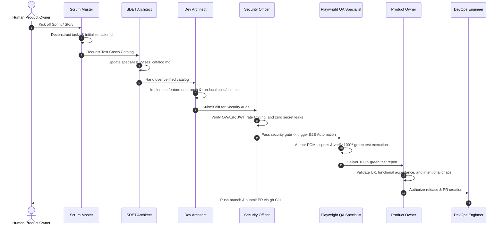

# BuggyBooks Master Plan & End-to-End Architecture

**Project**: BuggyBooks  
**Target Goal**: Full-Stack E-Commerce Web Application specifically engineered as a realistic practice target for Software Quality Engineering (SQE), Chaos Engineering, and Test Automation (UI, API, Performance, Security, and Accessibility).  
**Repository Structure**: Segmented Monorepo (`backend/`, `frontend/`, `playwright-e2e/`, `shared/`, `.agents/`, `.github/`, `specs/`).

---

## 1. Project Overview & Core Mission

BuggyBooks is a complete bookstore application built from scratch with deliberate anti-patterns, dynamic latencies, obfuscated locators, and chaotic server behaviors. It serves as an enterprise-grade proving ground for test automation frameworks (Selenium, Playwright, Cypress, JMeter, K6) and modern AI agent pairing.

### Live Deployments
* **Frontend UI**: [https://buggy-books-fe.onrender.com](https://buggy-books-fe.onrender.com)
* **Backend API**: [https://buggy-books.onrender.com/api](https://buggy-books.onrender.com/api)

---

## 2. Full-Stack System Architecture

```text
buggy-books/
├── package.json                   # Monorepo concurrency & installation scripts
├── docker-compose.yml             # Containerized multi-service orchestration
├── AGENTS.md                      # Canonical AI agent rules & multi-persona workflow
├── intentional_bugs.md            # Catalog of intentional chaos & anti-patterns
├── project_summary.md             # Project milestones & achievements
├── README.md                      # Comprehensive developer setup & user guide
├── .agents/                       # Antigravity customization root
│   └── skills/                    # 11 Specialized Persona Roles & Technical Skills
├── backend/                       # Express + TypeScript API layer
│   ├── src/
│   │   ├── app.ts                 # Express app initialization & middleware configuration
│   │   ├── server.ts              # HTTP & WebSocket server bootstrap
│   │   ├── routes/                # API route definitions
│   │   ├── controllers/           # HTTP controllers
│   │   ├── services/              # Business logic services
│   │   ├── repositories/          # Data access layer
│   │   ├── middleware/            # Auth, Rate Limiting, Helmet, CORS, Error handlers
│   │   ├── errors/                # Standardized custom error classes
│   │   ├── data/                  # File-based JSON database (db.json)
│   │   └── __tests__/             # Jest unit & integration test suites
│   ├── package.json
│   └── tsconfig.json
├── frontend/                      # React 19 + Vite + TypeScript SPA
│   ├── src/
│   │   ├── App.tsx                # Main router & app layout
│   │   ├── api.ts                 # Fetch client & backend API bindings
│   │   ├── components/            # Reusable UI components & custom Web Components
│   │   ├── pages/                 # Catalog, Cart, Checkout, Login, Register, Profile
│   │   ├── hooks/                 # Custom React hooks (useCart, useCheckout, useProfile)
│   │   ├── styles/                # HSL Design System tokens & CSS modules
│   │   ├── mocks/                 # Mock Service Worker (MSW) server & handlers
│   │   └── __tests__/             # Vitest + React Testing Library component tests
│   ├── eslint.config.js           # ESLint 9 Flat Config
│   └── package.json
├── playwright-e2e/                # Active Playwright E2E Automation Framework
│   ├── src/
│   │   ├── config/                # playwright.config.ts & env.config.ts
│   │   ├── core/base/             # BasePage, base.fixture.ts, failure-hook.ts
│   │   ├── pages/                 # Page Object Models extending BasePage
│   │   ├── tests/ui/              # UI E2E test suites (UserManagement, Catalog, Checkout...)
│   │   ├── tests/api/             # API test suites (Books, Cart, Chaos, Logging...)
│   │   ├── test-data/             # JSON test data mirroring spec paths
│   │   └── utils/                 # api.util.ts, common.util.ts, dom-cleaner.ts
│   ├── scripts/                   # finalize-spec.ts, save-snapshot.ts
│   └── package.json
├── shared/types/                  # Shared TypeScript type definitions
└── specs/                         # test_cases_catalog.md (single source of truth)
```

---

## 3. Backend Implementation Details (`/backend`)

### Technology Stack
* **Runtime & Framework**: Node.js 20+, Express 4.18+, TypeScript 5.3+.
* **Datastore**: File-based JSON database (`src/data/db.json`), enabling instantaneous test-state resetting via API.
* **Authentication**: JWT (`jsonwebtoken`) with refresh token rotation and `bcrypt` password hashing.
* **Security Middleware**: `helmet` (HTTP headers), `cors` (origin isolation), `express-rate-limit` (60 req/min baseline), `csrf-csrf` (CSRF token validation).
* **Logging & Observability**: `winston` structured logger with correlation IDs (`x-trace-id`) propagated on requests.
* **Real-time**: `socket.io` for live notifications and WebSocket chaos resilience testing.
* **Validation**: `zod` runtime schemas on API boundary inputs.
* **Testing**: `jest` + `ts-jest` + `supertest` covering 10 test suites (66 tests).

### Key API Endpoints & Capabilities
1. **Auth & Profile**:
   - `POST /api/auth/register` — User registration with password strength criteria.
   - `POST /api/auth/login` — Authentication returning JWT token & refresh cookies.
   - `POST /api/auth/refresh` — Token rotation.
   - `GET /api/user/profile` & `POST /api/user/avatar` — User profile & file upload handling.
2. **Catalog & Inventory**:
   - `GET /api/books` — Paginated book catalog with keyword search and category filtering.
   - `GET /api/books/:id` — Single book details.
   - `GET /api/inventory/report` — Simulates a heavy 3-second delay for performance testing.
3. **Cart & Checkout**:
   - `GET /api/cart`, `POST /api/cart/items`, `PUT /api/cart/items/:id`, `DELETE /api/cart/items/:id` — Full cart lifecycle.
   - `POST /api/checkout/process` — **Flaky Endpoint** throwing 15% random `500 Internal Server Error` to exercise automation retry logic.
   - `GET /api/orders` & `POST /api/orders` — Order placement and history retrieval.
4. **Chaos Control API**:
   - `POST /api/test/reset` — Atomically restores factory database state and resets all chaos flags.
   - `POST /api/test/config` — Toggles error rates, artificial latencies, and rate limit bypasses.

---

## 4. Frontend Implementation Details (`/frontend`)

### Technology Stack
* **Framework**: React 19, Vite 8, TypeScript 6.
* **Routing**: React Router 7.
* **Styling**: Vanilla CSS using custom HSL design tokens (`_variables.css`, `_base.css`) with sleek dark-mode glassmorphism accents.
* **Notifications**: `react-hot-toast` for responsive feedback.
* **Component Testing**: Vitest 4 + React Testing Library + MSW (Mock Service Worker) for isolated API mocking (26 component tests).

### UI Pages & Anti-Patterns for Automation Practice
1. **Catalog Page (`src/pages/Catalog.tsx`)**:
   - Dynamic delays (500ms–3500ms) on "Add to Cart" state changes.
   - Obfuscated locators: Absence of semantic `id` and `data-testid` attributes forces relative XPath/CSS axis chaining.
2. **Book Detail Page (`src/pages/BookDetail.tsx`)**:
   - Deep-linkable item view with stock counters, dynamic review ratings, and price calculations.
3. **Cart Page (`src/pages/Cart.tsx`)**:
   - Quantity increment/decrement, line-item removal, live subtotals, and persistent storage synchronization.
4. **Checkout Wizard & Custom Web Component (`src/pages/Checkout.tsx`)**:
   - Multi-step customer address, shipping selection, and payment processing.
   - **Shadow DOM Encapsulation**: The order summary total is rendered inside a native Web Component (`<order-summary-box>`) in an isolated Shadow Root, requiring automation tools to pierce the shadow boundary.
5. **Authentication & Profile Pages (`Login.tsx`, `Register.tsx`, `Profile.tsx`)**:
   - Protected route guards redirecting unauthenticated users to `/login`.
   - Avatar picture upload with instant UI preview.

---

## 5. Playwright E2E Automation Framework (`/playwright-e2e`)

### Architecture & Design Patterns
* **Runner**: `@playwright/test` ^1.58.0 in TypeScript.
* **Page Object Model (POM)**:
  - Base class: `src/core/base/base.page.ts` (extends `CommonFunctions`).
  - Strict encapsulation: Private getters for locators at top of class; action methods calling `BasePage` wrappers (`doClick`, `doEnterText`, `doGetText`, `doesElementExist`) with Winston logging.
* **Fixtures (`src/core/base/base.fixture.ts`)**:
  - Custom `test` fixture auto-injecting page objects (`signUpPage`, `catalogPage`, `cartPage`, `checkoutPage`, `profilePage`, `notificationCenter`, `commonFunctions`, `networkInterceptor`).
  - Automatic `afterEach` failure capture hook writing diagnostic artifacts.
* **Self-Healing & Failure Artifacts (`src/core/base/failure-hook.ts`)**:
  - Automatically writes `reports/snapshots/failure-context.json` (traceback + failed locator), `failure-dom.html` (DOM state), and `failure-aria.yaml` (accessibility tree) on test failure.
* **Assertion Strategy**:
  - Soft assertions collected during execution via `commonFunctions.compareTwoValues(...)`.
  - Consolidated single hard assertion concluding each test scenario.
* **Reporting**: Allure Playwright (`allure-playwright`) with step attachments and network capture logs.
* **Quality Gate Script (`scripts/finalize-spec.ts`)**:
  - Static AST validator preventing antipatterns: bans static `waitForTimeout()` sleeps, absolute XPaths, and inline selectors.

---

## 6. Testing Strategy & Traceability Catalog

The repository maintains full test pyramid coverage tracked centrally in `specs/test_cases_catalog.md`:

| Test Suite Layer | Framework / Tools | Location | Count / Coverage |
| :--- | :--- | :--- | :--- |
| **Backend Unit & Integration** | Jest, Supertest | `backend/src/__tests__/` | 10 Suites / 66 Tests |
| **Frontend Component Tests** | Vitest, RTL, MSW | `frontend/src/__tests__/` | 9 Suites / 26 Tests |
| **Playwright UI E2E** | Playwright Test, Chrome | `playwright-e2e/src/tests/ui/` | 18+ Active Feature Specs |
| **Playwright API Contracts** | Playwright Test, Axios | `playwright-e2e/src/tests/api/` | 8+ Active Endpoint Specs |
| **Accessibility (A11y)** | `@axe-core/playwright` | `src/tests/ui/A11y/` | WCAG 2.1 AA automated scans |
| **Visual Regression** | Playwright PixelMatch | `src/tests/ui/VisualRegression/` | Full-page visual chaos diffs |
| **WebSocket Resilience** | Socket.io client | `src/tests/ui/WebSockets/` | Disconnect/reconnect events |

---

## 7. Multi-Agent Personas & Virtual Team Workflow

Canonical rules are governed by [`AGENTS.md`](file:///c:/BuggyBooks/buggy-books/AGENTS.md) and backed by 11 Antigravity skills in `.agents/skills/`:



---

## 8. CI/CD Pipelines & DevOps

* **GitHub Actions Workflows (`.github/workflows/`)**:
  - `ci.yml` — Runs Jest backend tests, Vitest frontend tests, and TypeScript compilation on PRs.
  - `playwright-ci.yml` — Runs Playwright E2E suites against local dev servers.
  - `playwright-docker.yml` — Sharded parallel Playwright runs in isolated Docker containers.
  - `codacy.yml` — Automated static security & code scanning SARIF upload.
* **Containerization**:
  - `docker-compose.yml` orchestrating `backend/Dockerfile` and `frontend/Dockerfile` behind an `nginx` reverse proxy.

---

## 9. Phase Roadmap & Milestone Matrix

| Phase | Theme & Focus | Status | Key Deliverables |
| :--- | :--- | :--- | :--- |
| **[Phase 1](file:///c:/BuggyBooks/buggy-books/planning/Phases/phase_1_foundations_and_quality.md)** | Full-Stack Quality & Developer Foundations | `[COMPLETED]` | Monorepo DX scripts, Jest teardown leak fixes, 34 frontend ESLint fixes. |
| **[Phase 2](file:///c:/BuggyBooks/buggy-books/planning/Phases/phase_2_automation_and_resilience.md)** | Test Automation Modernization & CI/CD Resilience | `[COMPLETED]` | Dynamic Playwright discovery, generic `ApiUtil<T>`, POM static linter, staged CI/CD. |
| **[Phase 3](file:///c:/BuggyBooks/buggy-books/planning/Phases/phase_3_sandboxing_chaos_and_performance.md)** | Multi-User Sandboxing, Chaos Engineering & Performance Resilience | `[COMPLETED]` | Session sandboxing (`x-test-session-id`), Chaos UI Dashboard, k6 & Lighthouse CI gates. |
| **[Phase 4](file:///c:/BuggyBooks/buggy-books/planning/Phases/phase_4_cicd_optimization_and_fast_feedback.md)** | CI/CD Pipeline Optimization, Artifact Caching & Fast-Feedback Gates | `[COMPLETED]` | Build artifact sharing (`upload-artifact`), deterministic `npm ci`, Stage 1 parallel quality gates, workflow concurrency, PR performance tiering. |
| **[Phase 5](file:///c:/BuggyBooks/buggy-books/planning/Phases/phase_5_enterprise_qa_and_e2e_gates.md)** | Enterprise Quality Assurance, Ephemeral E2E Gates & Performance Baseline Regression | `[COMPLETED]` | Ephemeral PR smoke gate, strict failure enforcement (zero continue-on-error), local webServer orchestration, endurance soak testing, baseline delta regression gate. |
| **[Phase 6](file:///c:/BuggyBooks/buggy-books/planning/Phases/phase_6_hermetic_regression_sharding_and_performance_governance.md)** | Hermetic Regression Orchestration, Native Sharding & Performance Governance | `[PLANNED]` | Ephemeral containerized regression staging, session-isolated chaos config, storageState auth caching, native dynamic sharding (--shard=1/N), tiered baselines, closed-loop quarantine audit. |


