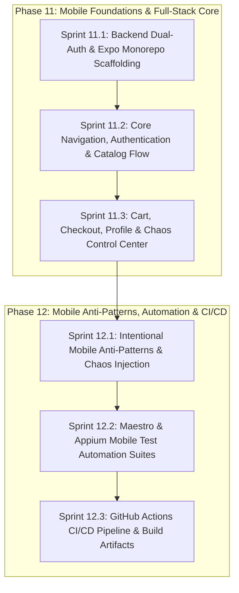

# BuggyBooks Mobile App Master Plan (Android & Apple iOS)

**Project**: BuggyBooks Mobile  
**Target Goal**: Cross-platform native mobile application (Android & Apple iOS) specifically engineered as an authentic practice target for Mobile Software Quality Engineering (SQE), Mobile Chaos Engineering, and Mobile Test Automation (Appium, Maestro, Detox).  
**Repository Structure**: Segmented Monorepo (`backend/`, `frontend/`, `mobile/`, `playwright-e2e/`, `mobile-automation/`, `shared/`, `planning/`).  
**Document Identifier**: `PLAN-MASTER-MOBILE-APP-001`  
**Status**: Approved for Implementation  

---

## 1. Executive Summary & Core Mission

[BuggyBooks](file:///c:/BuggyBooks/buggy-books/README.md) is an established full-stack e-commerce proving ground designed with deliberate anti-patterns, dynamic latencies, obfuscated locators, and chaotic server behaviors. While the web platform (React 19 + Playwright) is mature, **the repository currently lacks native mobile application support for both Android and Apple iOS.**

Playwright's current mobile support in [playwright.config.ts](file:///c:/BuggyBooks/buggy-books/playwright-e2e/src/config/playwright.config.ts#L151-L169) only emulates mobile browser viewports (Pixel 5 and iPhone 13 web browsers) and cannot interact with native mobile controls, device permissions, soft keyboards, native view hierarchies, or mobile operating system lifecycles.

### Key Objectives
1. **Develop a True Cross-Platform Native Mobile App**: Target both **Android** (.apk / .aab) and **Apple iOS** (.ipa / app bundle) using a single, unified codebase in React Native (Expo) with 100% TypeScript.
2. **Seamless Monorepo Integration**: Integrate `mobile/` as an npm workspace package sharing domain models and contracts directly from [`@buggybooks/types`](file:///c:/BuggyBooks/buggy-books/shared/package.json).
3. **Upgrade Backend for Dual Authentication**: Expand [authController.ts](file:///c:/BuggyBooks/buggy-books/backend/src/controllers/authController.ts) and [api.ts](file:///c:/BuggyBooks/buggy-books/backend/src/routes/api.ts) to support both `Authorization: Bearer <jwt>` and `httpOnly` cookies in a 100% backward-compatible manner.
4. **Engineered Mobile Anti-Patterns & Chaos**: Implement mobile-specific deliberate testing hurdles (obfuscated native `testID`s, keyboard occlusion, dynamic button delays, stochastic checkout gateway timeouts, and simulated network interruptions).
5. **Mobile Test Automation Proving Ground**: Deliver a complete end-to-end mobile test automation framework utilizing **Maestro** and **Appium** (UIAutomator2 + XCUITest), integrated into GitHub Actions CI/CD.

---

## 2. End-to-End System Architecture

```text
                               +--------------------------------------------+
                               |              BuggyBooks Repo               |
                               +--------------------------------------------+
                                                     |
                    +--------------------------------+-------------------------------+
                    |                                |                                |
       +--------------------------+    +--------------------------+    +--------------------------+
       |   backend/ (Node/Exp)    |    |      shared/types/       |    |   frontend/ (React 19)   |
       |  - Cookie Auth           |    |  - Book, CartItem        |    |  - Web UI (Vite SPA)     |
       |  - Bearer Token Auth     |<---|  - Order, ChaosConfig    |--->|  - Cookie/CSRF client    |
       |  - Chaos Endpoints       |    |  - AuthUser, Profile     |    |  - Playwright E2E Web    |
       +--------------------------+    +--------------------------+    +--------------------------+
                    ^                                |
                    | REST / WebSockets              |
                    | (Bearer JWT)                   v
       +----------------------------------------------------------+
       |                   mobile/ (Expo / React Native)          |
       |  - Native Navigation (Native Stack + Bottom Tabs)        |
       |  - Expo SecureStore (Keychain / Keystore Token Storage)  |
       |  - Native Screens: Catalog, Detail, Cart, Checkout,      |
       |    Profile (ImagePicker), Chaos Control Center           |
       |  - Intentional Mobile Anti-Patterns (Locators/Keyboard)  |
       +----------------------------------------------------------+
                    |                                |
                    v                                v
       +--------------------------+    +--------------------------+
       |    Android Build (APK)   |    |      Apple iOS Build     |
       |  - Target: Android 10-15 |    |  - Target: iOS 15-18     |
       |  - Engine: Hermes        |    |  - Engine: Hermes        |
       |  - Automation: UIAut2    |    |  - Automation: XCUITest  |
       +--------------------------+    +--------------------------+
                    ^                                ^
                    |                                |
       +----------------------------------------------------------+
       |                mobile-automation/ Framework              |
       |  - Maestro declarative YAML flows (.maestro/)            |
       |  - Appium WebdriverIO Page Object Model suites (E2E)     |
       +----------------------------------------------------------+
```

---

## 3. Technology Stack & Selection Rationale

### Evaluation Matrix

| Criterion | **React Native (Expo + TS)** *(Selected)* | **Capacitor / Ionic (WebView)** | **Flutter (Dart)** | **Native (Kotlin & Swift)** |
| :--- | :--- | :--- | :--- | :--- |
| **Monorepo Synergy** | **Native**: Shares npm workspaces & `@buggybooks/types` directly. | Shares web assets, but wraps in a WebView. | Zero code/type sharing; requires Dart rewrite. | Requires two separate native codebases. |
| **Native Element Hierarchy** | **True Native**: Renders native `android.widget.*` and `UI*` elements. | Web DOM inside a WebView container. | Custom Skia/Impeller canvas rendering. | Pure native platform elements. |
| **QA Automation Realism** | **100% Authentic**: Exercises Appium UIAutomator2, XCUITest, & Maestro. | Fails: Tests webview context instead of native mobile selectors. | Good, but widget tree differs from native platform standards. | 100% authentic, but doubles automation overhead. |
| **Windows Developer Workflow** | **Superior**: Test Android on local emulator; test iOS on iPhone via Expo Go. | Requires native IDEs for custom plugins. | Requires local Android SDK; no iOS on Windows. | Requires macOS for iOS; cannot build on Windows. |
| **Maintenance Burden** | Single codebase, single language (TypeScript). | Single codebase, but fragile webview bridges. | Introduces a 2nd language into the team. | 2 separate languages, 2 separate codebases. |

### Technical Blueprint for `mobile/`
* **Framework**: React Native 0.76+ with Expo SDK 52+
* **Language**: TypeScript 5.3+ (strict mode enabled)
* **JS Engine**: Hermes (for instant cold-starts and low memory footprint)
* **Monorepo Bundler**: `metro.config.js` configured with `watchFolders = [workspaceRoot]`, `nodeModulesPaths`, and `config.resolver.disableHierarchicalLookup = true` for deterministic `@buggybooks/types` hoisted resolution
* **Navigation**: React Navigation 7.x (`@react-navigation/native`, `@react-navigation/native-stack`, `@react-navigation/bottom-tabs`)
* **Secure Storage**: `expo-secure-store` (hardware-backed Android Keystore and iOS Keychain)
* **Hardware & Native APIs**:
  * `expo-image-picker` (Camera and Photo Library avatar upload)
  * `expo-haptics` (tactile feedback on actions)
  * `expo-network` (connection state detection for offline chaos)
* **Icons & Fonts**: `@expo/vector-icons` (Ionicons / MaterialCommunityIcons)
* **Networking**: Centralized typed Axios / Fetch HTTP client with auto-refresh interceptors

---

## 4. Backend Prerequisites & Dual-Authentication Layer

To allow mobile devices to authenticate seamlessly while maintaining complete stability for the existing React web app, Playwright E2E tests, and k6 performance scripts, the backend will implement a **Dual-Authentication Strategy**.

### 4.1 Token Delivery on Login, Register & Refresh
* **File**: [backend/src/controllers/authController.ts](file:///c:/BuggyBooks/buggy-books/backend/src/controllers/authController.ts)
* **Current Behavior**: Sets `token` and `refreshToken` cookies, but does not return them in the JSON body; `refresh()` strictly inspects `req.cookies?.refreshToken` and returns no tokens in JSON.
* **Upgraded Behavior**:
  ```typescript
  export const login = async (req: Request, res: Response) => {
    const { username, password } = req.body;
    const result = await authService.login(username, password);
    setAuthCookies(res, result.token, result.refreshToken);
    // Return tokens in JSON for mobile clients while keeping cookies for web
    res.json({
      message: 'Login successful',
      username: result.username,
      token: result.token,
      refreshToken: result.refreshToken
    });
  };

  export const register = async (req: Request, res: Response) => {
    const { username, password, fullName } = req.body;
    const result = await authService.register(username, password, fullName);
    setAuthCookies(res, result.token, result.refreshToken);
    res.status(201).json({
      message: 'Registration successful',
      username: result.username,
      token: result.token,
      refreshToken: result.refreshToken
    });
  };

  export const refresh = async (req: Request, res: Response) => {
    // 1. Check request body / header (Mobile client) or fallback to cookie (Web SPA)
    const incomingRefreshToken = req.body?.refreshToken || req.cookies?.refreshToken;
    // authService.refresh() is updated to return { token: newToken, refreshToken: newRefreshToken, username }
    const result = authService.refresh(incomingRefreshToken);
    setAuthCookies(res, result.token, result.refreshToken);
    res.json({
      success: true,
      username: result.username,
      token: result.token,
      refreshToken: result.refreshToken
    });
  };
  ```

### 4.2 Dual-Mode Authentication Middleware
* **File**: [backend/src/routes/api.ts](file:///c:/BuggyBooks/buggy-books/backend/src/routes/api.ts#L34-L57)
* **Current Behavior**: Only inspects `req.cookies?.token`.
* **Upgraded Behavior**:
  ```typescript
  const authenticateToken = (req: Request, res: Response, next: NextFunction) => {
    // 1. Check Authorization: Bearer <token> (Native Mobile Client)
    const authHeader = req.headers.authorization;
    let token = authHeader && authHeader.startsWith('Bearer ')
      ? authHeader.split(' ')[1]
      : req.cookies?.token; // 2. Fallback to httpOnly cookie (Web SPA Client)

    if (!token) {
      return res.status(401).json({ error: 'Unauthorized: Token required' });
    }

    try {
      const user = jwt.verify(token, JWT_SECRET) as AuthUser;
      if (!user || user.type !== 'access') {
        return res.status(403).json({ error: 'Forbidden: Invalid token' });
      }
      req.user = user;

      // Preserve AsyncLocalStorage structured logging context
      const store = loggerStore.getStore();
      if (store && user.username) {
        store.username = user.username;
      }

      next();
    } catch {
      return res.status(403).json({ error: 'Forbidden: Invalid token' });
    }
  };
  ```

### 4.3 CSRF Protection Adaptation & Multer Avatar Storage
* **Files**: [backend/src/app.ts](file:///c:/BuggyBooks/buggy-books/backend/src/app.ts#L36-L53), [backend/src/controllers/profileController.ts](file:///c:/BuggyBooks/buggy-books/backend/src/controllers/profileController.ts#L22-L37)
* **CSRF Strategy**: When a request contains a valid `Authorization: Bearer <token>` header (non-empty token string), skip `doubleCsrf` checks because Bearer tokens stored in mobile Keychain/Keystore are immune to browser cross-site ambient credential attacks.
* **Multer Filename Generation**: In [backend/src/routes/api.ts](file:///c:/BuggyBooks/buggy-books/backend/src/routes/api.ts), `authenticateToken` runs before `handleAvatarUpload`, populating `req.user = user`. Update `profileController.ts` `diskStorage.filename` to directly leverage `(req as Request).user?.username || 'anonymous'`, ensuring mobile uploads save as `<username>-<timestamp>.ext` cleanly without redundant JWT decoding.

### 4.4 Multi-Platform Network Resolution
Mobile clients connect through different IP gateways depending on runtime environment:
* **Android Studio Emulator**: Maps host `localhost` to `http://10.0.2.2:4000/api` (default fallback).
* **Apple iOS Simulator**: Can directly access `http://localhost:4000/api`.
* **CI / Headless Emulator with `adb reverse`**: Directly accesses `http://localhost:4000/api`.
* **Physical Devices (Wi-Fi)**: Dynamic LAN IP (e.g., `http://192.168.1.X:4000/api`).
* **Remote / Production**: `https://buggy-books-api.onrender.com/api`.
* **Implementation**: `mobile/src/api/config.ts` prioritizes `process.env.EXPO_PUBLIC_API_URL`, falling back to `Platform.OS === 'android' ? 'http://10.0.2.2:4000/api' : 'http://localhost:4000/api'`.

---

## 5. Mobile Application Feature Specifications

The mobile app replicates all core bookstore capabilities while adapting them into a modern native mobile interface.

```text
                               +-----------------------------+
                               |     Root Stack Navigator    |
                               +-----------------------------+
                                      |               |
             +------------------------+               +------------------------+
             |                                                                 |
    [Unauthenticated]                                                   [Authenticated]
  Auth Stack Navigator                                               Bottom Tab Navigator
  ├── LoginScreen                                                    ├── 📖 CatalogTab (Stack)
  └── RegisterScreen                                                 │   ├── CatalogScreen
                                                                     │   └── BookDetailScreen
                                                                     ├── 🛒 CartTab (Stack)
                                                                     │   ├── CartScreen
                                                                     │   └── CheckoutScreen
                                                                     ├── 👤 ProfileTab (Screen)
                                                                     └── ⚙️ ChaosTab (Screen)
```

### 5.1 Screens & Flows

1. **Authentication Stack (`LoginScreen`, `RegisterScreen`)**:
   * Clean native form inputs with validation feedback.
   * Secure storage of credentials and JWTs via `expo-secure-store`.
   * Switch between Login and Register with keyboard-aware layout.

2. **Catalog & Search (`CatalogScreen`)**:
   * Fluid two-column native `FlatList` with pull-to-refresh (`RefreshControl`).
   * Dynamic search header with debounced query dispatching to `GET /api/books?q=`.
   * Book cards displaying cover image, title, author, price, rating badge, and stock count.

3. **Book Detail (`BookDetailScreen`)**:
   * High-resolution cover display, synopsis, metadata, and quantity picker.
   * "Add to Cart" button with dynamic timeout simulation and feedback toasts.

4. **Cart Management (`CartScreen`)**:
   * List of selected books with item quantity increment/decrement and swipe-to-delete.
   * Live subtotal calculation synced with backend state via `GET /api/cart`.
   * Quick navigation to Checkout.

5. **Checkout Wizard (`CheckoutScreen`)**:
   * Native form fields: First Name, Last Name, Shipping Address, Credit Card.
   * Total summary breakdown.
   * "Confirm & Pay" button executing `POST /api/checkout/process`.
   * Full handling of the 15% stochastic `500 Internal Server Error` with retry alerts.

6. **User Profile & Avatar (`ProfileScreen`)**:
   * User details display (username, full name).
   * Avatar display with native camera/gallery picker via `expo-image-picker`.
   * Multipart/form-data upload to `POST /api/profile/upload`.
   * Logout button with atomic cache and secure storage wipe.

7. **Chaos Control Center (`ChaosScreen`)**:
   * Dedicated mobile dashboard to inspect and configure runtime chaos via `GET /api/test/config` and `POST /api/test/config`.
   * Sliders for `checkoutFailureRate` (0.0 to 1.0) and `inventoryDelayMs` (0ms to 5000ms).
   * One-tap database reset button (`POST /api/test/reset`).

---

## 6. Engineered Mobile Anti-Patterns & QA Automation Challenges

To ensure the mobile app fulfills BuggyBooks' primary identity as a **test automation benchmark**, deliberate mobile anti-patterns will be designed into the app:

| Anti-Pattern Ref | Bug / Challenge Description | Technical Implementation | Mobile QA Learning Goal |
| :--- | :--- | :--- | :--- |
| **MOB-B1** | **Obfuscated Native Locators** | Critical buttons and inputs omit clean `testID`s and use dynamic or obfuscated IDs (e.g., `testID="btn_cart_dyn_44"` or `testID="txt_usr_77"`). | Forces automation engineers to write robust XPath, accessibility label hierarchy, or text-matching locators instead of relying on trivial IDs. |
| **MOB-B2** | **Keyboard Occlusion on Checkout** | Omission of `KeyboardAvoidingView` on the checkout screen causes the soft keyboard to cover the "Submit Order" button on standard screen sizes. | Exercises automation scrolling logic (`driver.hideKeyboard()`, swipe gestures, or `scrollIntoView()`). |
| **MOB-B3** | **Dynamic Add-to-Cart Delays** | Tapping "Add to Cart" triggers a random client-side delay between 500ms and 3500ms before firing the API request and updating the cart badge. | Prevents hardcoded thread sleeps; exercises dynamic polling, explicit waits, and condition-based assertions. |
| **MOB-B4** | **Stochastic Gateway Timeout** | `POST /api/checkout/process` fails 15% of the time with HTTP 500 `Payment Gateway Timeout`. | Tests automation retry loops, exponential backoff, and mobile alert dismiss/retry handling. |
| **MOB-B5** | **Simulated Network Interruption** | A chaos toggle simulates flaky cellular connectivity, throwing random network timeouts and displaying an offline banner. | Validates client-side resilience, offline alerts, and automated recovery tests. |
| **MOB-B6** | **Landscape Orientation Glitch** | Rotating device to landscape skews the checkout modal layout and hides the submit button behind the bottom navigation bar. | Tests device rotation commands in Appium/Maestro and multi-orientation visual regression. |

---

## 7. Mobile Test Automation Framework (`mobile-automation/`)

To match the high standards of [playwright-e2e](file:///c:/BuggyBooks/buggy-books/playwright-e2e), the mobile app will be paired with a dedicated automation suite supporting both **Maestro** (modern declarative YAML) and **Appium** (enterprise programmatic Page Object Model).

```text
mobile-automation/
├── .maestro/                         # Maestro Declarative Test Flows
│   ├── config.yaml
│   ├── auth/
│   │   ├── 01_login_success.yaml
│   │   └── 02_login_invalid_creds.yaml
│   ├── catalog/
│   │   ├── 03_search_and_filter.yaml
│   │   └── 04_add_to_cart_delay.yaml
│   └── checkout/
│       ├── 05_checkout_retry_loop.yaml
│       └── 06_keyboard_occlusion.yaml
├── src/                              # Appium + WebdriverIO + TypeScript
│   ├── config/
│   │   ├── wdio.android.conf.ts      # UIAutomator2 driver config
│   │   └── wdio.ios.conf.ts          # XCUITest driver config
│   ├── core/
│   │   ├── BaseMobileScreen.ts       # Action wrappers with gestures & logging
│   │   └── MobileLogger.ts           # Winston structured step logging
│   ├── screens/                      # Mobile Page Object Models
│   │   ├── LoginScreen.ts
│   │   ├── CatalogScreen.ts
│   │   ├── CartScreen.ts
│   │   └── CheckoutScreen.ts
│   └── specs/                        # Test Scenarios
│       ├── auth.e2e.spec.ts
│       ├── catalog.e2e.spec.ts
│       └── checkout_chaos.e2e.spec.ts
├── package.json
└── tsconfig.json
```

### 7.1 Sample Maestro Flow (`.maestro/checkout/05_checkout_retry_loop.yaml`)
```yaml
appId: com.buggybooks.app
---
- launchApp:
    clearState: true
- tapOn: "txt_usr_77"
- inputText: "admin"
- tapOn: "txt_pwd_99"
- inputText: "password123"
- tapOn: "Sign In"
- assertVisible: "Book Catalog"
- tapOn:
    text: "Add to Cart"
    index: 0
- extendedWaitUntil:
    visible: "Cart (1)"
    timeout: 5000
- tapOn: "Cart"
- tapOn: "Proceed to Checkout"
- tapOn: "txt_f1"
- inputText: "Quality"
- tapOn: "txt_l1"
- inputText: "Engineer"
- tapOn: "txt_c99"
- inputText: "4111222233334444"
# Handles intentional keyboard occlusion and stochastic checkout failure
- hideKeyboard
- scrollUntilVisible:
    element: "Place Order"
    direction: DOWN
- tapOn: "Place Order"
```

---

## 8. Phased Implementation Roadmap & Sprints

The implementation is broken down into structured two-week sprints following the established project planning conventions:



### Phase 11: Mobile Foundations & Full-Stack Core

#### **Sprint 11.1: Backend Dual-Auth & Expo Monorepo Scaffolding**
* **Effort**: 5 Story Points
* **Deliverables**:
  1. Update [backend/src/controllers/authController.ts](file:///c:/BuggyBooks/buggy-books/backend/src/controllers/authController.ts) (`login`, `register`, and `refresh`) and [backend/src/services/auth.service.ts](file:///c:/BuggyBooks/buggy-books/backend/src/services/auth.service.ts) to support refresh token rotation and return `token` and `refreshToken` in JSON responses.
  2. Update [backend/src/routes/api.ts](file:///c:/BuggyBooks/buggy-books/backend/src/routes/api.ts) to support `Authorization: Bearer <token>` header alongside cookies, preserving `loggerStore` context.
  3. Update `@buggybooks/types` (`shared/types/`) to export shared `AuthUser`, `AuthTokensResponse`, and `UserProfile` contracts.
  4. Update [backend/src/controllers/profileController.ts](file:///c:/BuggyBooks/buggy-books/backend/src/controllers/profileController.ts) Multer storage to inspect Bearer tokens for avatar filename attribution.
  5. Update [backend/src/app.ts](file:///c:/BuggyBooks/buggy-books/backend/src/app.ts) to exempt Bearer-authenticated requests from CSRF token enforcement.
  6. Register `"mobile"` in the root [package.json](file:///c:/BuggyBooks/buggy-books/package.json) workspaces and scaffold Expo TypeScript project in `buggy-books/mobile` linked with `@buggybooks/types` via `mobile/metro.config.js` (`disableHierarchicalLookup: true`), ensuring React 18.3.1 dependency isolation against frontend React 19, and configure `mobile/tsconfig.json` with `typeRoots` and `paths` pointing strictly to `mobile/node_modules` to isolate React 18 types from root `@types/react` 19.
  7. Provision unit test runner (`jest-expo`, `@testing-library/react-native`) in `mobile/package.json`.
  8. Verify all existing Jest backend and Vitest frontend unit tests and Playwright web tests remain 100% green.

#### **Sprint 11.2: Core Navigation, Authentication & Catalog Flow**
* **Effort**: 5 Story Points
* **Deliverables**:
  1. Build `AuthContext` backed by `expo-secure-store` for safe token persistence, with unit tests covering storage and context lifecycle.
  2. Implement Centralized API client (`mobile/src/api/client.ts`) with automatic token injection and dual-status silent refresh interceptor handling both `401 Unauthorized` and `403 Forbidden: Invalid token` with mutex queue.
  3. Build Root Stack Navigator switching between Auth Stack and Main Bottom Tab Navigator.
  4. Implement `LoginScreen` and `RegisterScreen` with validation errors and baseline accessibility labels.
  5. Implement `CatalogScreen` with paginated book retrieval, search filtering, and responsive grid layout.
  6. Implement `BookDetailScreen` displaying metadata, price, stock, and synopsis.
  7. SDET catalogs mobile test scenarios in `specs/test_cases_catalog.md` (`MOB_AUTH_01`–`MOB_CAT_05`).

#### **Sprint 11.3: Cart, Checkout, Profile & Chaos Control Center**
* **Effort**: 5 Story Points
* **Deliverables**:
  1. Build `CartContext` for live state synchronization with backend `GET /api/cart`, with unit test coverage.
  2. Implement `CartScreen` with item list, quantity adjustment, removal, and live subtotals.
  3. Implement `CheckoutScreen` with multi-field customer details and order confirmation.
  4. Implement `ProfileScreen` with native avatar upload using `expo-image-picker` and multipart/form-data streaming without manual boundary collisions.
  5. Implement `ChaosScreen` allowing testers to view and toggle error rates and delays directly from the mobile device.
  6. Security Champion (SEC) audits multipart uploads and camera permissions; SDET catalogs Cart, Checkout, Profile, and Chaos test scenarios (`MOB_CART_01`–`MOB_CHAOS_01`).

---

### Phase 12: Mobile Anti-Patterns, Automation & CI/CD

#### **Sprint 12.1: Intentional Mobile Anti-Patterns & Chaos Injection**
* **Effort**: 5 Story Points
* **Deliverables**:
  1. Refactor catalog buttons and checkout fields with intentional obfuscated and dynamic `testID`s (MOB-B1).
  2. Add simulated 500ms–3500ms dynamic setTimeout delays on "Add to Cart" actions (MOB-B3).
  3. Induce intentional keyboard occlusion on `CheckoutScreen` by omitting `KeyboardAvoidingView` (MOB-B2).
  4. Add client-side recovery UI with an in-screen retry banner for handling the backend's 15% `500 Payment Gateway Timeout` (MOB-B4).
  5. Implement simulated network dropouts and offline error banner toggles (MOB-B5).
  6. Unlock orientation in `app.json` (`"orientation": "default"`) to enable MOB-B6 landscape shift bug.
  7. Document all mobile anti-patterns (MOB-B1 through MOB-B6) in [intentional_bugs.md](file:///c:/BuggyBooks/buggy-books/intentional_bugs.md) with SEC review.

#### **Sprint 12.2: Maestro & Appium Mobile Test Automation Suites**
* **Effort**: 5 Story Points
* **Deliverables**:
  1. Initialize `mobile-automation/` package and register in root `package.json` workspaces.
  2. Configure `.maestro/` with declarative test flows covering Login, Catalog Search, Cart, Checkout Retry, Keyboard Dismissal, and Orientation.
  3. Configure Appium WebdriverIO with TypeScript, Page Object Models, driver provisioning (`"driver:android": "appium driver install uiautomator2"` and macOS-scoped `"driver:ios": "appium driver install xcuitest"`), and Winston structured step logging.
  4. Implement Android UIAutomator2 and iOS XCUITest configuration profiles.
  5. Verify 100% green execution on Android Emulator and iOS Simulator; catalog automation specs in `specs/test_cases_catalog.md` (`MOB_E2E_01` through `MOB_E2E_06`).

#### **Sprint 12.3: GitHub Actions Mobile CI/CD Pipeline & Build Artifacts**
* **Effort**: 5 Story Points
* **Deliverables**:
  1. Add SHA-pinned `mobile-lint`, `mobile-typecheck`, and `mobile-unit-tests` quality gates to [.github/workflows/ci.yml](file:///c:/BuggyBooks/buggy-books/.github/workflows/ci.yml) with step summaries (`node scripts/generate-test-summary.js mobile mobile`) and coverage artifact uploads.
  2. Create a dedicated `.github/workflows/mobile-ci.yml` workflow running Maestro flows on hardware-accelerated `macos-14` / `macos-latest` runners using SHA-pinned `reactivecircus/android-emulator-runner`, adding `$HOME/.maestro/bin` to `$GITHUB_PATH`.
  3. Prebuild native Android project (`npx expo prebuild --platform android --clean`) and compile self-signed standalone APK with pre-bundled offline JS assets (`npx expo export --platform android` followed by `cd mobile/android && ./gradlew assembleDebug`), configuring `adb reverse tcp:4000 tcp:4000` with `EXPO_PUBLIC_API_URL=http://localhost:4000/api` and `adb shell settings put system accelerometer_rotation 1` for hermetic execution in CI.
  4. Configure Expo EAS build workflow (`mobile/eas.json` and `mobile-release.yml`) for automated Android APK artifact generation on release tags.
  5. Add mobile test summaries and execution reports to GitHub Actions step summaries.

---

## 9. Monorepo Scripts & Developer Experience

Once integrated, developers and QA engineers can operate the entire stack via unified npm scripts from the monorepo root:

```json
{
  "scripts": {
    "dev:backend": "npm run dev --workspace=buggy-books-backend",
    "dev:frontend": "npm run dev --workspace=frontend",
    "dev:mobile": "npm start --workspace=mobile",
    "dev:mobile:android": "npm run android --workspace=mobile",
    "dev:mobile:ios": "npm run ios --workspace=mobile",
    "lint:mobile": "npm run lint --workspace=mobile",
    "typecheck:mobile": "npx tsc --noEmit -p mobile/tsconfig.json",
    "test:mobile:unit": "npm test --workspace=mobile",
    "test:mobile:maestro": "maestro test mobile-automation/.maestro/",
    "test:mobile:appium": "npm run test:e2e --workspace=mobile-automation",
    "test:mobile:appium:android": "npm run test:android --workspace=mobile-automation",
    "test:mobile:appium:ios": "npm run test:ios --workspace=mobile-automation",
    "build:mobile:android": "cd mobile && npx eas-cli build --platform android --profile preview --local"
  }
}
```

---

## 10. Risk Management & Technical Mitigations

| Risk | Impact | Likelihood | Mitigation Strategy |
| :--- | :--- | :--- | :--- |
| **Breaking Web & Playwright Tests with Auth Changes** | High | Low | Implement additive Dual-Authentication: cookies remain default for web; Bearer token header is checked first. All existing tests run in CI to verify zero regressions. |
| **Backend Token Expiry Returning 403 Instead of 401** | High | High | Configure mobile HTTP client interceptor to catch both HTTP 401 and HTTP 403 (specifically when error body includes `Invalid token`) to trigger silent token refresh mutex without failure. |
| **Monorepo React Version Conflict (React 19 vs 18.3.1)** | High | Medium | Strictly pin `"react": "18.3.1"` in `mobile/package.json`, preserve local `mobile/node_modules/react`, and configure Metro to search `projectRoot` before `workspaceRoot`. |
| **Emulator Network Host Mismatches** | Medium | Medium | Implement automatic URL resolver prioritizing `EXPO_PUBLIC_API_URL` (for `adb reverse` in CI), falling back to `10.0.2.2` (Android local) and `localhost` (iOS). |
| **Windows Platform iOS & Maestro Limitations** | Medium | Medium | Use **Expo Go** for physical iPhones. On Windows, execute Maestro via native Windows binary (`irm https://get.maestro.mobile.dev | iex`) or WSL2 with ADB port forwarding; Appium runs natively on Windows Node.js. |
| **Complex Appium Environment Setup for Contributors** | High | Medium | Provide **Maestro** as the primary lightweight E2E tool (single binary, zero Node/Java driver setup), with Appium reserved for enterprise POM regression practice. |

---

## 11. Traceability & Project Alignment

This Master Plan is directly aligned with:
* **[README.md](file:///c:/BuggyBooks/buggy-books/README.md)**: Extends the platform purpose to Native Mobile QA engineering.
* **[intentional_bugs.md](file:///c:/BuggyBooks/buggy-books/intentional_bugs.md)**: Catalogs new mobile anti-patterns (MOB-B1 to MOB-B6).
* **[planning/Master/master_plan.md](file:///c:/BuggyBooks/buggy-books/planning/Master/master_plan.md)**: Complements Phases 1–10 by establishing **Phase 11** (Mobile Core) and **Phase 12** (Mobile Automation).
* **[AGENTS.md](file:///c:/BuggyBooks/buggy-books/AGENTS.md)**: Adheres to the Multi-Agent virtual team development lifecycle (PO -> SM -> SDET -> SDE -> SEC -> QA -> DO).
