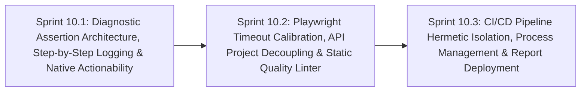

# Phase 10: E2E Automation Modernization, Hermetic CI/CD & Test Governance

**Phase Identifier**: `PHASE-10-E2E-AUTOMATION-MODERNIZATION-HERMETIC-CICD-AND-TEST-GOVERNANCE`  
**Phase Status**: Planned (Ready for Backlog Grooming & Sprint Execution)  
**Phase Leads**: Principal SDET & DevOps Automation Architect  
**Primary Personas**: Principal SDET, Automation Engineer, DevOps Architect, QA Performance Specialist, Scrum Master  

---

## 1. Executive Summary & Phase Theme

While Phase 9 hardens the monorepo foundation, backend persistence, and frontend resilience, **Phase 10** addresses the core Quality Engineering automation infrastructure: the **Playwright E2E Test Suite**, **CI/CD Pipelines**, and **Automated Quality Gates**.

During our quality review, several critical automation anti-patterns were uncovered:
1. **The Boolean Accumulator Assertion Anti-Pattern**: Tests accumulate boolean values via `isPass = await compareTwoValues(...)` and assert at the end with `expect(a && b && c).toBeTruthy()`. When a failure occurs, reports display an opaque `Expected: true, Received: false`, hiding what failed and causing subsequent test steps to execute blindly and trigger cascading timeouts.
2. **The Need for Diagnostic Logging without Sacrificing Assertions**: The engineering team introduced custom logging to capture timestamped Winston and Allure steps. We must preserve and enhance this logging visibility while replacing the boolean masking with rich, contextual Playwright assertions that display exact failure diffs (`Expected 2, Received 1`).
3. **Inflated 5-Minute Timeouts (300 Seconds)**: In [playwright.config.ts](file:///c:/BuggyBooks/buggy-books/playwright-e2e/src/config/playwright.config.ts#L14), `timeout: 300 * 1000` causes tests with missing elements or unhandled popups to hang for 300 seconds per attempt, severely bloating CI run times.
4. **Coupled API Tests & Redundant UI Setups**: Pure API specs in `src/tests/api/` are assigned to the `chromium` project, which triggers UI browser authentication (`auth.setup.ts`) to launch a browser and navigate to the frontend just to run REST endpoint tests.
5. **Fragile Process Orchestration & Report Deployment**: CI workflows rely on raw `nohup ... &` and `pkill -f` to start and stop services, k6 runs mutate production `db.json` without cleanup, and report deployment uses broken repository context variables on non-push events.

**Phase 10** transforms BuggyBooks into a gold-standard automation suite featuring diagnostic step-by-step logging, fast fail-fast assertions, native auto-waiting, lightweight API test projects, managed CI web servers, and resilient multi-report deployment.

---

## 2. Architectural Scope & Target Outcomes

| Subsystem | Current State / Constraint | Phase Target Outcome |
| :--- | :--- | :--- |
| **Playwright Assertions & Logging** | `isPass = await compareTwoValues(...)` and `expect(f1 && f2 && f3).toBeTruthy()` masks failure causes with `true===false`. | Refactor to rich diagnostic assertion helpers (`verifyValue`, `verifyText`, `verifyCount`) that log to Winston & Allure with timestamps AND assert directly with Playwright matchers, showing exact diffs and line numbers. |
| **Actionability & Auto-Waiting** | `BasePage.doClick` and `doEnterText` wrap native Playwright calls with manual `waitFor({ timeout: 3000 })` and try-catch fallbacks. | Remove artificial 3000ms delay wrappers; rely on Playwright's native auto-waiting engine (visibility, stability, actionability) with calibrated element timeouts. |
| **Test Timeouts & Feedback Speed** | `timeout: 300 * 1000` (5 minutes) per test in `playwright.config.ts`. | Reduce default test timeout to `30,000ms` (30s), with specific scoped overrides (`test.setTimeout(60000)`) for intentional chaos/slow endpoints. |
| **API Test Suite Decoupling** | API tests run under `chromium` project, executing `auth.setup.ts` and booting a headless browser. | Create a dedicated `api` project in `playwright.config.ts` running purely headless via Playwright `request` context without browser overhead. |
| **E2E Static Quality Linter** | Only a custom regex script (`finalize-spec.ts`) exists; no ESLint rules enforce modern Playwright standards. | Implement `eslint-plugin-playwright` and TypeScript ESLint rules in `playwright-e2e` enforcing unawaited promises, valid assertions, and locator rules. |
| **CI/CD Process & Report Governance** | Fragile `nohup` and `pkill -f` server management; `ci.yml` benchmarks mutate `db.json`; broken `${{ github.event.repository.name }}` in report deployment. | Leverage Playwright managed `webServer` block in CI; isolate database state between benchmark tiers; fix GitHub Pages deployment context variables. |

---

## 3. Sprints in this Phase

### Sprint Breakdown

1. **[Sprint 10.1: Diagnostic Assertion Architecture, Step-by-Step Logging & Native Actionability](file:///c:/BuggyBooks/buggy-books/planning/Sprints/sprint_10_1_diagnostic_assertion_architecture_and_step_logging.md)**
   - *Estimated Effort*: 5 Story Points
   - *Key Deliverables*:
     - Modernized `CommonFunctions` and `BasePage` maintaining full Winston structured logging (`logger.info`, `errorLogger.error`) and Allure step tracking.
     - Introduction of typed verification helpers (`verifyValue`, `verifyText`, `verifyCount`, `verifyElementVisible`) that execute direct Playwright assertions and provide rich visual failure diffs.
     - Deprecation of the boolean accumulator pattern (`expect(a && b && c).toBeTruthy()`) across all test specs.
     - Removal of artificial 3000ms `waitFor` blocks in `BasePage.doClick` and `BasePage.doEnterText`, allowing Playwright's built-in auto-waiting to handle element actionability.

2. **[Sprint 10.2: Playwright Timeout Calibration, API Project Decoupling & Static Quality Linter](file:///c:/BuggyBooks/buggy-books/planning/Sprints/sprint_10_2_playwright_timeout_calibration_api_decoupling_and_linter.md)**
   - *Estimated Effort*: 5 Story Points
   - *Key Deliverables*:
     - Default test timeout reduction from 300s to 30s in [playwright.config.ts](file:///c:/BuggyBooks/buggy-books/playwright-e2e/src/config/playwright.config.ts).
     - Dedicated headless `api` project in `playwright.config.ts` running API specs via `request` context without booting Chromium or triggering UI `auth.setup.ts`.
     - Addition of `eslint-plugin-playwright` and ESLint configuration in `playwright-e2e`.
     - Enhancement of [finalize-spec.ts](file:///c:/BuggyBooks/buggy-books/playwright-e2e/scripts/finalize-spec.ts) with AST-based assertion checks.

3. **[Sprint 10.3: CI/CD Pipeline Hermetic Isolation, Process Management & Report Deployment](file:///c:/BuggyBooks/buggy-books/planning/Sprints/sprint_10_3_cicd_pipeline_hermetic_isolation_and_report_governance.md)**
   - *Estimated Effort*: 5 Story Points
   - *Key Deliverables*:
     - Adoption of native Playwright `webServer` block in CI, eliminating fragile `nohup` and `pkill -f` scripts.
     - Database state snapshotting and isolation between k6 performance tiers in [ci.yml](file:///c:/BuggyBooks/buggy-books/.github/workflows/ci.yml).
     - Fix for report deployment URL interpolation in [playwright-ci.yml](file:///c:/BuggyBooks/buggy-books/.github/workflows/playwright-ci.yml) (`github.repository` fallback).
     - Warm-up pre-flight check in [playwright-docker.yml](file:///c:/BuggyBooks/buggy-books/.github/workflows/playwright-docker.yml) to prevent 502/504 gateway timeouts against Render.
     - Alignment of [quarantine-audit.yml](file:///c:/BuggyBooks/buggy-books/.github/workflows/quarantine-audit.yml) with conditional `grepInvert`.

---

## 4. Definition of Done for Phase 10

- [ ] All Playwright UI and API tests produce detailed Winston logs AND fail with precise expected vs actual diffs on assertion failure.
- [ ] No spec files contain `expect(flag1 && flag2 && flag3).toBeTruthy()`.
- [ ] Default test timeout is calibrated to 30s; total test execution time is reduced by $>40\%$.
- [ ] API tests execute under the headless `api` project without launching a browser or running `auth.setup.ts`.
- [ ] ESLint runs in `playwright-e2e` with zero lint errors.
- [ ] CI pipeline runs hermetically using managed `webServer` without lingering background processes.
- [ ] Allure and Monocart reports deploy reliably with valid links on `workflow_dispatch` and `schedule` runs.
