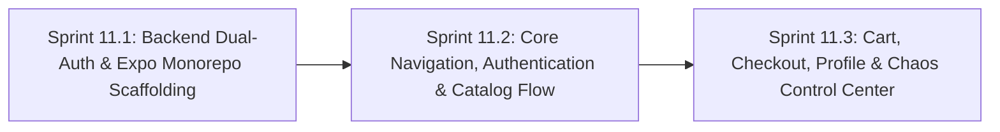

# Phase 11: Cross-Platform Mobile App Foundations (Android & iOS) & Dual-Auth

**Phase Identifier**: `PHASE-11-CROSS-PLATFORM-MOBILE-APP-FOUNDATIONS-AND-DUAL-AUTH`  
**Phase Status**: Planned (Ready for Backlog Grooming & Sprint Execution)  
**Phase Leads**: Mobile Engineering Lead & Full-Stack Architect  
**Primary Personas**: Mobile Developer, Full-Stack Architect, Backend Specialist, QA Specialist, Scrum Master  
**Master Plan Reference**: [planning/Master/mobile_app_master_plan.md](file:///c:/BuggyBooks/buggy-books/planning/Master/mobile_app_master_plan.md)  

---

## 1. Executive Summary & Phase Theme

BuggyBooks has established a proven full-stack web application for QA testing and chaos practice. However, modern Quality Engineering demands proficiency in **Mobile Test Automation** across real native element hierarchies (UIAutomator2 for Android and XCUITest for iOS).

**Phase 11** establishes the native cross-platform mobile foundation for BuggyBooks. It focuses on:
1. **Backend Dual-Authentication**: Upgrading the Express API to simultaneously support `Authorization: Bearer <jwt>` and `httpOnly` cookies in a 100% backward-compatible fashion.
2. **Monorepo Integration**: Scaffolding a native React Native / Expo application inside `mobile/` managed by root npm workspaces, sharing domain contracts from [`@buggybooks/types`](file:///c:/BuggyBooks/buggy-books/shared/package.json).
3. **Core Mobile Experience**: Building full mobile native screen flows for Authentication, Catalog search and browsing, Book Details, Cart, Checkout, User Profile (with Camera/Photo Library avatar upload), and the Chaos Control Center.

---

## 2. Architectural Scope & Target Outcomes

| Subsystem | Current State / Constraint | Phase Target Outcome |
| :--- | :--- | :--- |
| **Backend Authentication** | Strictly reads `req.cookies?.token`; does not return tokens in login/register JSON body. | Support **Dual-Auth**: Inspect `Authorization: Bearer <token>` first, fallback to cookie; return `token` and `refreshToken` in response payload. |
| **Backend CSRF Protection** | Enforces `doubleCsrf` cookie check on all mutating requests. | Automatically exempt requests presenting valid `Authorization: Bearer` headers from CSRF checks. |
| **Mobile Workspace Scaffolding** | No mobile workspace exists in the repository. | Scaffold `mobile/` using React Native 0.76+ & Expo SDK 52+ with TypeScript strict mode, linked to root `package.json`. |
| **Token Storage & Refresh** | LocalStorage used on web; insecure for mobile. | Implement hardware-backed token storage via `expo-secure-store` with silent token rotation on HTTP 401. |
| **Native Navigation & Shell** | React Router 7 for browser DOM only. | Implement React Navigation 7.x (Native Stack + Bottom Tab Navigator) with typed routes. |
| **Core Screens** | Web-only components. | Build native mobile screens: `LoginScreen`, `RegisterScreen`, `CatalogScreen`, `BookDetailScreen`, `CartScreen`, `CheckoutScreen`, `ProfileScreen`, `ChaosScreen`. |

---

## 3. Sprints in this Phase

### Sprint Breakdown

1. **[Sprint 11.1: Backend Dual-Auth & Expo Monorepo Scaffolding](file:///c:/BuggyBooks/buggy-books/planning/Sprints/sprint_11_1_backend_dual_auth_and_expo_monorepo_scaffolding.md)**
   * *Estimated Effort*: 5 Story Points
   * *Key Deliverables*:
     - Non-breaking update to `authController.ts` returning `token` and `refreshToken` in JSON.
     - Dual-mode `authenticateToken` middleware in `api.ts` supporting `Bearer` tokens.
     - CSRF bypass for Bearer-authenticated requests in `app.ts`.
     - Scaffolding of `mobile/` workspace with Expo and TypeScript, linked with `@buggybooks/types`.
     - 100% green verification on existing Jest and Playwright web tests.

2. **[Sprint 11.2: Core Navigation, Authentication & Catalog Flow](file:///c:/BuggyBooks/buggy-books/planning/Sprints/sprint_11_2_core_navigation_authentication_and_catalog_flow.md)**
   * *Estimated Effort*: 5 Story Points
   * *Key Deliverables*:
     - Secure token persistence using `expo-secure-store` in mobile `AuthContext`.
     - Centralized typed mobile API client with automatic token attachment and 401 refresh.
     - Root Native Stack Navigator with unauthenticated Auth Stack and authenticated Bottom Tabs.
     - Functional `LoginScreen` and `RegisterScreen` with native keyboard handling.
     - `CatalogScreen` featuring a 2-column `FlatList`, pull-to-refresh, search bar, and stock counters.
     - `BookDetailScreen` displaying high-res cover, synopsis, ratings, and quantity selector.

3. **[Sprint 11.3: Cart, Checkout, Profile & Chaos Control Center](file:///c:/BuggyBooks/buggy-books/planning/Sprints/sprint_11_3_cart_checkout_profile_and_chaos_control_center.md)**
   * *Estimated Effort*: 5 Story Points
   * *Key Deliverables*:
     - `CartContext` maintaining synchronized cart state with backend `GET /api/cart`.
     - `CartScreen` with item list, quantity adjusters, swipe-to-delete, and checkout CTA.
     - `CheckoutScreen` with address and payment fields, subtotal summary, and order submission.
     - `ProfileScreen` with user details and native camera/gallery avatar upload via `expo-image-picker`.
     - `ChaosScreen` mobile control center to view and adjust error rates and reset test data.
