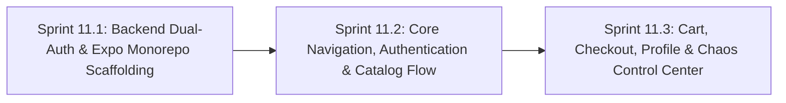

# Phase 11: Cross-Platform Mobile App Foundations (Android & iOS) & Dual-Auth

**Phase Identifier**: `PHASE-11-CROSS-PLATFORM-MOBILE-APP-FOUNDATIONS-AND-DUAL-AUTH`  
**Phase Status**: Planned (Ready for Backlog Grooming & Sprint Execution)  
**Phase Leads**: Mobile Engineering Lead & Full-Stack Architect  
**Primary Personas**: Mobile Developer, Full-Stack Architect, Backend Specialist, QA Specialist, Scrum Master  
**Master Plan Reference**: [planning/Master/mobile_app_master_plan.md](file:///c:/BuggyBooks/buggy-books/planning/Master/mobile_app_master_plan.md)  

---

## 1. Executive Summary & Phase Theme

BuggyBooks has established a proven full-stack web application for QA testing and chaos practice. However, modern Quality Engineering demands proficiency in **Mobile Test Automation** across real native element hierarchies (UIAutomator2 for Android and XCUITest for iOS).

**Phase 11** establishes the native cross-platform mobile foundation for BuggyBooks. It focuses on:
1. **Backend Dual-Authentication**: Upgrading the Express API to simultaneously support `Authorization: Bearer <jwt>` and `httpOnly` cookies in a 100% backward-compatible fashion.
2. **Monorepo Integration**: Scaffolding a native React Native / Expo application inside `mobile/` managed by root npm workspaces, sharing domain contracts from [`@buggybooks/types`](file:///c:/BuggyBooks/buggy-books/shared/package.json).
3. **Core Mobile Experience**: Building full mobile native screen flows for Authentication, Catalog search and browsing, Book Details, Cart, Checkout, User Profile (with Camera/Photo Library avatar upload), and the Chaos Control Center.

---

## 2. Architectural Scope & Target Outcomes

| Subsystem | Current State / Constraint | Phase Target Outcome |
| :--- | :--- | :--- |
| **Backend Authentication** | Strictly reads `req.cookies?.token`; does not return tokens in login/register/refresh JSON payload. | Support **Dual-Auth**: Inspect `Authorization: Bearer <token>` first, fallback to cookie; return `token` and `refreshToken` in login, register, and refresh responses. |
| **Backend CSRF Protection** | Enforces `doubleCsrf` cookie check on all mutating requests. | Automatically exempt requests presenting valid `Authorization: Bearer` headers from CSRF checks. |
| **Profile Avatar Multer Storage** | Multer `diskStorage` only extracts username from `req.cookies?.token`. | Inspect `Authorization: Bearer` header inside Multer engine so mobile uploads save as `<username>-<timestamp>.ext`. |
| **Mobile Workspace Scaffolding** | No mobile workspace exists in the repository. | Scaffold `mobile/` using React Native 0.76+ & Expo SDK 52+ with TypeScript strict mode, linked to root `package.json` workspaces with monorepo `metro.config.js`. |
| **Token Storage & Refresh** | LocalStorage used on web; insecure for mobile. | Implement hardware-backed token storage via `expo-secure-store` with silent token rotation and mutex queuing on HTTP 401. |
| **Native Navigation & Shell** | React Router 7 for browser DOM only. | Implement React Navigation 7.x (Native Stack + Bottom Tab Navigator) with typed routes. |
| **Core Screens** | Web-only components. | Build native mobile screens: `LoginScreen`, `RegisterScreen`, `CatalogScreen`, `BookDetailScreen`, `CartScreen`, `CheckoutScreen`, `ProfileScreen`, `ChaosScreen`. |
| **Test Catalog Traceability** | Zero mobile test cases cataloged in `specs/test_cases_catalog.md`. | Establish official `MOB_AUTH_*`, `MOB_CAT_*`, `MOB_CART_*`, `MOB_CHECK_*`, `MOB_PROF_*` catalog entries. |

---

## 3. Sprints in this Phase

### Sprint Breakdown

1. **[Sprint 11.1: Backend Dual-Auth & Expo Monorepo Scaffolding](file:///c:/BuggyBooks/buggy-books/planning/Sprints/sprint_11_1_backend_dual_auth_and_expo_monorepo_scaffolding.md)**
   * *Estimated Effort*: 5 Story Points
   * *Key Deliverables*:
     - Non-breaking update to `authController.ts` and `auth.service.ts` supporting refresh token rotation and returning `token` and `refreshToken` in JSON for `login`, `register`, and `refresh`.
     - Dual-mode `authenticateToken` middleware in `api.ts` supporting `Bearer` tokens while preserving `loggerStore` structured logging context.
     - Contract expansion in `@buggybooks/types` (`shared/types/`) exporting shared `AuthUser`, `AuthTokensResponse`, and `UserProfile` interfaces.
     - Multer `diskStorage` update in `profileController.ts` to inspect Bearer tokens for avatar uploads.
     - CSRF bypass for Bearer-authenticated requests in `app.ts`.
     - Scaffolding of `mobile/` workspace with Expo (React 18.3.1 isolated from frontend React 19), TypeScript, and `jest-expo` unit test runner, configured with `mobile/metro.config.js` (`disableHierarchicalLookup: true`) to resolve `@buggybooks/types`.
     - Root npm script integration (`dev:mobile`, `lint:mobile`, `typecheck:mobile`, `test:mobile:unit`).
     - 100% green verification on existing Jest and Playwright web tests.

2. **[Sprint 11.2: Core Navigation, Authentication & Catalog Flow](file:///c:/BuggyBooks/buggy-books/planning/Sprints/sprint_11_2_core_navigation_authentication_and_catalog_flow.md)**
   * *Estimated Effort*: 5 Story Points
   * *Key Deliverables*:
     - Secure token persistence using `expo-secure-store` in mobile `AuthContext` with unit test coverage.
     - Centralized typed mobile API client with automatic token attachment and dual-status silent refresh interceptor handling both `401 Unauthorized` and `403 Forbidden: Invalid token` with mutex queue.
     - Root Native Stack Navigator with unauthenticated Auth Stack and authenticated Bottom Tabs.
     - Functional `LoginScreen` and `RegisterScreen` with native keyboard handling and accessibility labels.
     - `CatalogScreen` featuring a 2-column `FlatList`, pull-to-refresh, search bar, and stock counters.
     - `BookDetailScreen` displaying high-res cover, synopsis, ratings, and quantity selector.
     - SDET drafting of `MOB_AUTH_01`–`MOB_CAT_05` in `specs/test_cases_catalog.md`.

3. **[Sprint 11.3: Cart, Checkout, Profile & Chaos Control Center](file:///c:/BuggyBooks/buggy-books/planning/Sprints/sprint_11_3_cart_checkout_profile_and_chaos_control_center.md)**
   * *Estimated Effort*: 5 Story Points
   * *Key Deliverables*:
     - `CartContext` maintaining synchronized cart state with backend `GET /api/cart` with unit test coverage.
     - `CartScreen` with item list, quantity adjusters, swipe-to-delete, and checkout CTA.
     - `CheckoutScreen` with address and payment fields, subtotal summary, and order submission.
     - Build `ProfileScreen` with native camera/gallery avatar upload via `expo-image-picker` with resilient multipart/form-data streaming.
     - `ChaosScreen` mobile control center to view and adjust error rates and reset test data.
     - Security Champion (SEC) audit of multipart uploads and camera permissions.
     - SDET cataloging of Cart, Checkout, Profile, and Chaos test scenarios (`MOB_CART_01`–`MOB_CHAOS_01`) in `specs/test_cases_catalog.md`.

---

## 4. Definition of Done for Phase 11

- [ ] Backend dual-authentication supports both `Authorization: Bearer` and `httpOnly` cookies across `/api/login`, `/api/register`, `/api/auth/refresh`, and `/api/profile/upload` with 100% passing unit and integration tests.
- [ ] Mutating requests with Bearer tokens bypass CSRF checks without compromising cookie-based CSRF protection.
- [ ] `mobile/` is registered in root workspaces, passes `npm test --workspace=mobile`, and compiles cleanly via `npm run typecheck:mobile` and `npm run lint:mobile`.
- [ ] `mobile/metro.config.js` resolves hoisted `@buggybooks/types` with zero bundler errors.
- [ ] Complete native user journey passes on both Android Emulator and iOS Simulator: Login -> Browse Catalog -> View Book -> Add to Cart -> Checkout -> Place Order.
- [ ] Profile avatar upload handles camera and gallery inputs, successfully saving images under authenticated user IDs via Multer.
- [ ] Chaos settings screen updates backend error rates and reflects changes immediately in subsequent API calls.
- [ ] Existing web test suites (`npm run test:backend`, `npm run test:frontend`, `npm run test:e2e:local`) remain 100% green with zero regressions.
- [ ] All mobile feature test cases are documented and cataloged in `specs/test_cases_catalog.md`.
