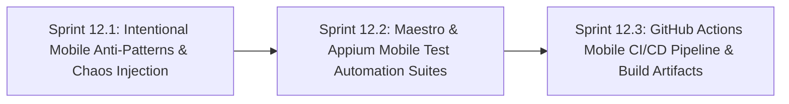

# Phase 12: Mobile Chaos Engineering, Appium/Maestro Automation & Mobile CI/CD

**Phase Identifier**: `PHASE-12-MOBILE-CHAOS-ENGINEERING-APPIUM-MAESTRO-AUTOMATION-AND-CICD`  
**Phase Status**: Planned (Ready for Backlog Grooming & Sprint Execution)  
**Phase Leads**: Principal Mobile SDET & DevOps Automation Architect  
**Primary Personas**: Principal SDET, Mobile Automation Engineer, DevOps Architect, Security Champion, Scrum Master  
**Master Plan Reference**: [planning/Master/mobile_app_master_plan.md](file:///c:/BuggyBooks/buggy-books/planning/Master/mobile_app_master_plan.md)  

---

## 1. Executive Summary & Phase Theme

With the mobile application foundation and core screens delivered in Phase 11, **Phase 12** elevates BuggyBooks Mobile into a world-class **Mobile Quality Engineering proving ground**.

This phase encompasses:
1. **Deliberate Mobile Anti-Patterns & Chaos**: Injecting authentic mobile challenges (obfuscated native `testID`s, keyboard occlusion covering form buttons, dynamic add-to-cart delays, stochastic checkout errors, simulated network dropouts, and multi-orientation glitches).
2. **Comprehensive Mobile Automation Framework**: Delivering automated test suites in both **Maestro** (modern declarative YAML flows) and **Appium** (enterprise WebdriverIO + TypeScript Page Object Model).
3. **Automated Mobile CI/CD**: Integrating mobile linting, typechecking, and headless Android emulator test execution into GitHub Actions, accompanied by automated EAS build pipelines.

---

## 2. Architectural Scope & Target Outcomes

| Subsystem | Current State / Constraint | Phase Target Outcome |
| :--- | :--- | :--- |
| **Mobile Anti-Patterns** | No mobile-specific testing hurdles exist. | Implement MOB-B1 to MOB-B6 (obfuscated locators, keyboard occlusion, dynamic delay, gateway timeout, offline dropouts, orientation glitch with `"orientation": "default"`). |
| **Declarative Mobile E2E** | No native mobile automation exists. | Author full smoke test suite using **Maestro** (`mobile-automation/.maestro/`) covering login, search, cart, retry loops, and gestures for fast CI validation. |
| **Programmatic Mobile E2E** | Playwright only covers desktop/mobile browser emulations. | Implement **Appium + WebdriverIO** in TypeScript (`mobile-automation/`) with POM architecture targeting Android UIAutomator2 and iOS XCUITest for deep regression. |
| **Mobile CI/CD Pipeline** | CI only verifies backend, frontend, and web Playwright. | Add `.github/workflows/mobile-ci.yml` running mobile lint, typecheck, and headless Android emulator test execution on hardware-accelerated `macos-latest` runners (`reactivecircus/android-emulator-runner`). |
| **Mobile Build Artifacts** | No automated mobile compilation. | Configure automated Expo EAS preview builds producing downloadable Android APKs and iOS simulator builds via `.github/workflows/mobile-release.yml`. |
| **Test Catalog Traceability** | No mobile anti-pattern or automation specs cataloged. | Document all mobile automation scenarios in `specs/test_cases_catalog.md` (`MOB_E2E_*`). |

---

## 3. Sprints in this Phase

### Sprint Breakdown

1. **[Sprint 12.1: Intentional Mobile Anti-Patterns & Chaos Injection](file:///c:/BuggyBooks/buggy-books/planning/Sprints/sprint_12_1_intentional_mobile_anti_patterns_and_chaos_injection.md)**
   * *Estimated Effort*: 5 Story Points
   * *Key Deliverables*:
     - Implementation of obfuscated `testID`s and dynamic accessibility labels on buttons and inputs.
     - Simulated 500ms–3500ms dynamic setTimeout delay on "Add to Cart".
     - Intentional omission of `KeyboardAvoidingView` on checkout causing soft keyboard occlusion.
     - Client-side error banner and retry loop handling for the 15% stochastic `500 Payment Gateway Timeout`.
     - Simulated network dropout toggle and offline banner.
     - Landscape orientation layout clipping bug on checkout modal with `"orientation": "default"` enabled in `app.json`.
     - Cataloging of MOB-B1 through MOB-B6 in [intentional_bugs.md](file:///c:/BuggyBooks/buggy-books/intentional_bugs.md) with Security Champion (SEC) review.

2. **[Sprint 12.2: Maestro & Appium Mobile Test Automation Suites](file:///c:/BuggyBooks/buggy-books/planning/Sprints/sprint_12_2_maestro_and_appium_mobile_test_automation_suites.md)**
   * *Estimated Effort*: 8 Story Points
   * *Key Deliverables*:
     - Creation of `mobile-automation/` package registered in root `package.json` workspaces.
     - Maestro YAML test flows in `.maestro/` covering auth, catalog, cart, checkout retry, keyboard handling, and orientation shifts.
     - Appium WebdriverIO framework with TypeScript, Page Object Models, driver provisioning (`uiautomator2` and `xcuitest`), and Winston structured step logging.
     - Execution profiles for Android UIAutomator2 and iOS XCUITest.
     - 100% green execution across automated test flows on both platforms.
     - Full traceability of automated flows in `specs/test_cases_catalog.md` (`MOB_E2E_01` to `MOB_E2E_06`).

3. **[Sprint 12.3: GitHub Actions Mobile CI/CD Pipeline & Build Artifacts](file:///c:/BuggyBooks/buggy-books/planning/Sprints/sprint_12_3_github_actions_mobile_cicd_pipeline_and_build_artifacts.md)**
   * *Estimated Effort*: 5 Story Points
   * *Key Deliverables*:
     - SHA-pinned mobile quality gates (`mobile-lint`, `mobile-typecheck`, `mobile-unit-tests`) added to [.github/workflows/ci.yml](file:///c:/BuggyBooks/buggy-books/.github/workflows/ci.yml).
     - New `.github/workflows/mobile-ci.yml` executing Maestro flows against headless Android emulators on hardware-accelerated `macos-latest` runners using SHA-pinned `reactivecircus/android-emulator-runner`.
     - Standalone release APK bundling (`npx expo export` + `./gradlew assembleRelease`) and `adb reverse tcp:4000 tcp:4000` network bridging for hermetic, Metro-free execution in CI.
     - Expo EAS build integration (`mobile/eas.json` and `mobile-release.yml`) for automated Android APK artifact generation on release tags.
     - Step summaries and test report attachments published on GitHub Actions workflow runs.

---

## 4. Definition of Done for Phase 12

- [ ] All six deliberate mobile anti-patterns (MOB-B1 to MOB-B6) are verified functional on both Android and iOS devices/emulators.
- [ ] [intentional_bugs.md](file:///c:/BuggyBooks/buggy-books/intentional_bugs.md) is updated with complete detection and automation instructions for MOB-B1 through MOB-B6.
- [ ] Maestro declarative test flows execute with a 100% pass rate locally and in GitHub Actions CI.
- [ ] Appium WebdriverIO POM framework compiles strictly in TypeScript with zero lint warnings and successfully controls both Android UIAutomator2 and iOS XCUITest drivers.
- [ ] Mobile linting, typecheck, and unit test quality gates run in `.github/workflows/ci.yml` using SHA-pinned action references.
- [ ] Dedicated `.github/workflows/mobile-ci.yml` successfully boots an Android emulator on `macos-latest`, installs the prebuilt standalone APK, bridges network via `adb reverse`, and executes smoke flows without hanging or timing out.
- [ ] Release pipeline produces a sideloadable standalone Android APK artifact attached to GitHub releases.
- [ ] All automated mobile test scenarios (`MOB_E2E_01` through `MOB_E2E_06`) are cataloged in `specs/test_cases_catalog.md`.
