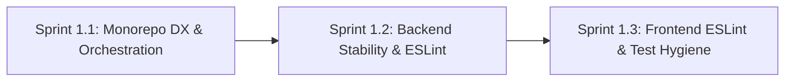

# Phase 1: Full-Stack Quality & Developer Foundations

**Phase Identifier**: `PHASE-1-FOUNDATIONS`  
**Phase Status**: Ready for Execution  
**Phase Leads**: Scrum Master & Dev Architect  
**Primary Personas**: Dev Architect, SDET Architect, Security Officer, DevOps Engineer  

---

## 1. Executive Summary & Phase Theme
**Phase 1** establishes foundational developer experience, builds robust monorepo orchestration, eliminates backend Jest worker resource leaks, and resolves all 34 frontend ESLint errors. This phase guarantees that all core services build cleanly, pass static analysis with zero errors, and provide deterministic execution for developers, CI runners, and AI agents.

---

## 2. Architectural Scope & Impact

| Layer / Subsystem | Current Defect / Gap | Phase Target Outcome |
| :--- | :--- | :--- |
| **Root Monorepo** | Incomplete `install:all` script (missing `playwright-e2e`); no single-command unit testing, typechecking, or building. | Unified root CLI (`npm run test:unit`, `npm run typecheck`, `npm run build`, `npm run install:all`). |
| **Express Backend** | Jest workers force-exit due to unclosed socket/server handles and timers; no ESLint configuration. | Clean teardown hooks in `setup.ts` (0 leak warnings) and backend ESLint flat configuration with Zero `any` policy. |
| **React 19 Frontend** | 34 ESLint errors (`any` types, synchronous `setState` in effects, unused vars); React 19 `act(...)` test warnings. | 100% clean ESLint pass (`0 errors, 0 warnings`), clean Vitest output, and typed API response bindings. |

---

## 3. Sprints in this Phase

### Sprint Breakdown
1. **[Sprint 1.1: Monorepo Orchestration & Developer Experience](file:///c:/BuggyBooks/buggy-books/planning/Sprints/sprint_1_1_monorepo_dx_and_orchestration.md)**
   - *Effort*: 3 Story Points
   - *Key Deliverable*: Fixed `install:all`, unified root scripts for testing, typechecking, and building.
2. **[Sprint 1.2: Backend Stability, Teardown Leaks & ESLint Setup](file:///c:/BuggyBooks/buggy-books/planning/Sprints/sprint_1_2_backend_stability_and_linting.md)**
   - *Effort*: 5 Story Points
   - *Key Deliverable*: Global teardown hooks in `backend/src/__tests__/setup.ts`, clean Jest exits, backend ESLint flat config.
3. **[Sprint 1.3: Frontend ESLint Resolution & Test Hygiene](file:///c:/BuggyBooks/buggy-books/planning/Sprints/sprint_1_3_frontend_eslint_and_test_hygiene.md)**
   - *Effort*: 5 Story Points
   - *Key Deliverable*: 34 ESLint fixes, React 19 `act()` warning elimination, `/shared/types/` contract bindings in `api.ts`.

---

## 4. Phase 1 Acceptance Criteria & Quality Gates
- [ ] `npm run install:all` installs dependencies across all subprojects cleanly.
- [ ] `npm run typecheck` passes across backend, frontend, and playwright-e2e with 0 errors.
- [ ] `cd backend && npm test` executes all 66 tests with 0 force-exit/open handle warnings.
- [ ] `cd backend && npm run lint` passes with 0 ESLint errors.
- [ ] `cd frontend && npm run lint` passes with 0 ESLint errors.
- [ ] `cd frontend && npm test` passes all 26 component tests without React 19 `act()` warnings.
- [ ] `npm run build` compiles production bundles cleanly for both backend and frontend.

---

## 5. Risk Assessment & Rollback Strategy
- **Risk**: Backend teardown changes might inadvertently terminate running dev servers.
  - *Mitigation*: Restrict teardown hooks specifically to `NODE_ENV=test` inside `src/__tests__/setup.ts`.
- **Risk**: Modifying `useEffect` hooks in frontend might alter component lifecycle behavior.
  - *Mitigation*: Run full Vitest component test suites after every hook refactor to verify zero functional regressions.
