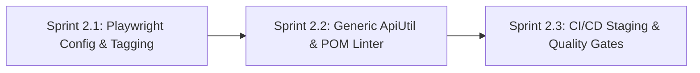

# Phase 2: Test Automation Modernization & CI/CD Resilience

**Phase Identifier**: `PHASE-2-AUTOMATION`  
**Phase Status**: Completed  
**Phase Leads**: SDET Architect & Playwright QA Specialist  
**Primary Personas**: Playwright QA Specialist, SDET Architect, DevOps Engineer, Product Owner  

---

## 1. Executive Summary & Phase Theme
**Phase 2** focuses on modernizing the Playwright E2E automation suite and optimizing the continuous integration pipeline. Key objectives include transitioning from static test lists to dynamic tag-based execution (`@smoke`, `@regression`, `@chaos`), making Page Object timeouts dynamically configurable, delivering end-to-end type safety in `ApiUtil<T>`, extending static analysis to Page Objects, and establishing staged CI gates that fail fast on lint/typecheck errors.

---

## 2. Architectural Scope & Impact

| Layer / Subsystem | Current Defect / Gap | Phase Target Outcome |
| :--- | :--- | :--- |
| **Playwright Config** | Hardcoded `specificTests` array (26 files) causes newly added tests to be ignored unless manually edited. | Dynamic glob discovery (`src/tests/**/*.spec.ts`) with tag filtering (`@smoke`, `@regression`). |
| **BasePage & Timeouts** | Static `DEFAULT_TIMEOUT = 60000` causes tests to hang for 60s during failure debugging. | Configurable timeouts via `envConfig.timeout` (default 15,000ms). |
| **API Test Utility** | `ApiUtil.makeRequest` returns `Promise<any>`, forfeiting compile-time response validation. | Generic typed method `makeRequest<T = unknown>(...): Promise<T | ApiResponse<T>>`. |
| **Static Linter** | `finalize-spec.ts` only checks `.spec.ts` files, allowing anti-patterns inside Page Objects. | Extended linter validating Page Objects (enforcing `BasePage` wrapper usage and private getters). |
| **CI Workflows** | `ci.yml` lacks frontend/backend linting; doesn't fail fast before heavy browser runs. | Staged CI pipeline: Lint/Build Gate → Unit Test Gate → Parallelized Playwright Gate. |

---

## 3. Sprints in this Phase

### Sprint Breakdown
1. **[Sprint 2.1: Playwright Config Modernization & Tag-Based Execution](file:///c:/BuggyBooks/buggy-books/planning/Sprints/sprint_2_1_playwright_tagging_and_config.md)**
   - *Effort*: 5 Story Points
   - *Key Deliverable*: Dynamic globbing, `@smoke`/`@regression` test annotations, configurable `BasePage` timeouts.
2. **[Sprint 2.2: Generic ApiUtil & Page Object Architecture Linter](file:///c:/BuggyBooks/buggy-books/planning/Sprints/sprint_2_2_api_util_generics_and_pom_linter.md)**
   - *Effort*: 5 Story Points
   - *Key Deliverable*: Generic `ApiUtil.makeRequest<T>`, expanded `finalize-spec.ts` with Page Object rules.
3. **[Sprint 2.3: CI/CD Pipeline Staging & Quality Gate Enforcement](file:///c:/BuggyBooks/buggy-books/planning/Sprints/sprint_2_3_cicd_staging_and_release_gates.md)**
   - *Effort*: 3 Story Points
   - *Key Deliverable*: Staged GitHub Actions workflow (`ci.yml`), linting enforcement, cache optimization.

---

## 4. Phase 2 Acceptance Criteria & Quality Gates
- [x] Any newly created `.spec.ts` file is automatically executed by Playwright without editing `playwright.config.ts`.
- [x] Running `npx playwright test --grep "@smoke"` executes exclusively smoke-tagged specs.
- [x] `BasePage` action methods fail within configured timeout thresholds (15s) rather than hanging for 60s.
- [x] `npm run finalize-spec` validates both `.spec.ts` files and `src/pages/*.page.ts` classes.
- [x] GitHub Actions CI pipeline blocks PR merges on ESLint errors, TypeScript errors, or failing Playwright tests.

---

## 5. Risk Assessment & Rollback Strategy
- **Risk**: Lowering `BasePage` default timeout from 60s to 15s could trigger false positives on slow CI nodes.
  - *Mitigation*: Expose `ELEMENT_TIMEOUT` environment variable so CI can adjust timeout without code edits.
- **Risk**: Tag refactoring might omit untagged tests from default test runs.
  - *Mitigation*: Ensure default test run executes all specs matching `**/*.spec.ts` when no grep filter is provided.
