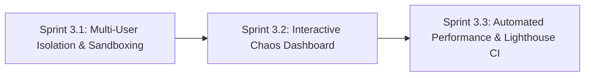

# Phase 3: Multi-User Sandboxing, Chaos Engineering & Performance Resilience

**Phase Identifier**: `PHASE-3-RESILIENCE`  
**Phase Status**: Ready for Execution (Follows Phase 2)  
**Phase Leads**: Dev Architect & SDET Architect  
**Primary Personas**: Dev Architect, SDET Architect, Playwright QA Specialist, DevOps Engineer, Security Officer, Product Owner  

---

## 1. Executive Summary & Phase Theme

**Phase 3** expands BuggyBooks into an advanced Software Quality Engineering (SQE) proving ground by enabling multi-user state isolation (test sandboxing), providing an interactive visual Chaos Control Dashboard in the React frontend, simulating realistic race conditions, and enforcing automated API/E2E performance benchmarking (k6 & Lighthouse CI quality gates).

---

## 2. Architectural Scope & Impact

| Layer / Subsystem | Current State / Gap | Phase Target Outcome |
| :--- | :--- | :--- |
| **Backend Datastore** | Shared single `db.json` causes mutating tests running concurrently to collide and corrupt test state. | Session-partitioned test sandboxing via `x-test-session-id` header supporting fully isolated parallel worker execution. |
| **Chaos Injection** | Chaos flags can only be modified via raw `POST /api/test/config` requests; no interactive UI. | Dedicated dark-mode glassmorphic Chaos Dashboard (`/admin/chaos`) with real-time sliders, latency toggles, and glitch injectors. |
| **Concurrency & Race Conditions** | Single-threaded in-memory operations lack realistic race-condition challenges. | Optimistic inventory locking and race condition simulation on checkout (multiple users competing for last stock copy). |
| **Performance Benchmarking** | No automated load or latency regression testing in CI. | Automated **k6** load test suite measuring p95/p99 latency and **Lighthouse CI** Core Web Vitals gate in GitHub Actions. |

---

## 3. Sprints in this Phase

### Sprint Breakdown

1. **[Sprint 3.1: Multi-User Session Isolation & Parallel Sandboxing](file:///c:/BuggyBooks/buggy-books/planning/Sprints/sprint_3_1_multi_user_isolation_and_sandboxing.md)**
   - *Estimated Effort*: 5 Story Points
   - *Key Deliverable*: Session-scoped storage partitioning (`x-test-session-id`), Playwright multi-worker fixture integration, zero-collision parallel test execution.

2. **[Sprint 3.2: Interactive Chaos Dashboard & Dynamic Fault Injection](file:///c:/BuggyBooks/buggy-books/planning/Sprints/sprint_3_2_interactive_chaos_dashboard.md)**
   - *Estimated Effort*: 5 Story Points
   - *Key Deliverable*: Frontend Chaos Control UI (`/admin/chaos`), inventory locking race condition simulation, E2E concurrency tests.

3. **[Sprint 3.3: Automated API Performance Testing & Lighthouse CI Quality Gates](file:///c:/BuggyBooks/buggy-books/planning/Sprints/sprint_3_3_automated_performance_and_lighthouse.md)**
   - *Estimated Effort*: 5 Story Points
   - *Key Deliverable*: k6 load testing scripts, Lighthouse CI action asserting Web Vitals thresholds, historical performance reports.

---

## 4. Phase 3 Acceptance Criteria & Quality Gates

- [ ] Multiple Playwright test workers execute mutating cart/checkout operations simultaneously with zero state cross-contamination.
- [ ] React frontend provides an interactive Chaos Dashboard at `/admin/chaos` reflecting live backend chaos state.
- [ ] Concurrent checkout race conditions correctly return status `409 Conflict` (Out of Stock) when stock reaches zero.
- [ ] Automated k6 load suite benchmarks key endpoints (`/api/books`, `/api/inventory/report`) under 50+ virtual users.
- [ ] GitHub Actions CI runs Lighthouse CI audits asserting minimum scores: Performance ≥ 90, Accessibility ≥ 95, SEO ≥ 90.

---

## 5. Risk Assessment & Rollback Strategy

- **Risk**: File-based session sandboxing could consume disk space if temporary test stores are not cleaned up.
  - *Mitigation*: Implement an automated TTL garbage collection mechanism in `backend` that flushes ephemeral session data older than 30 minutes.
- **Risk**: High concurrency in k6 load tests could saturate memory on local machines or CI runners.
  - *Mitigation*: Bound default virtual user ramps to 50 VUs for CI runs, with configurable CLI flags for heavier external stress testing.
