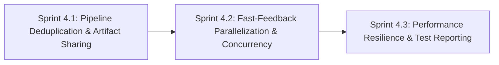

# Phase 4: CI/CD Pipeline Optimization, Artifact Caching & Fast-Feedback Gates

**Phase Identifier**: `PHASE-4-CICD-OPTIMIZATION`  
**Phase Status**: Planned (Ready for Sprint 4.1 Execution)  
**Phase Leads**: DevOps Engineer & SDET Architect  
**Primary Personas**: DevOps Engineer, SDET Architect, Dev Architect, Scrum Master, Product Owner  

---

## 1. Executive Summary & Phase Theme

**Phase 4** optimizes the BuggyBooks Continuous Integration & Delivery (`ci.yml`) pipeline by eliminating redundant builds and installations, parallelizing static quality gates for rapid feedback, introducing concurrency auto-cancellation and path-based filters, and isolating heavy performance stress benchmarks to eliminate flakiness on shared CI runners.

By transitioning from repetitive, un-cached job stages to an artifact-sharing, multi-tier execution graph, Phase 4 reduces pipeline execution duration by 40–50%, cuts GitHub Actions runner minute consumption, and guarantees reproducible, deterministic quality gates.

---

## 2. Architectural Scope & Impact

| Layer / Subsystem | Current State / Defect | Phase Target Outcome |
| :--- | :--- | :--- |
| **Frontend & Backend Build Duplication** | `frontend-build` and `backend-build` compile code in Stage 2, but downstream jobs (`lighthouse-ci`, `perf-benchmarks`) re-clone, re-install, and re-build from scratch. | Build once in Stage 2, publish `frontend-dist` and `backend-dist` via `actions/upload-artifact`, and consume directly downstream. |
| **Dependency Installation Determinism** | Frontend jobs inconsistently use `npm install` while backend uses `npm ci`, risking mutated lockfiles and non-deterministic package resolution. | Enforce `npm ci` strictly across all frontend and backend jobs. |
| **E2E Architecture Quality Gate** | `e2e-quality-gate` waits for 4 jobs (`needs: [backend-tests, frontend-tests, backend-build, frontend-build]`) and runs `tsc --noEmit` twice (once directly, once inside `finalize-spec.ts`). | Decouple dependencies to run in Stage 1 parallel fast feedback; remove duplicate direct `tsc --noEmit` call. |
| **Workflow Concurrency & Run Redundancy** | Rapid successive git pushes trigger parallel competing CI workflows with no cancellation mechanism. | Configure `concurrency: group: ${{ github.workflow }}-${{ github.ref }}, cancel-in-progress: true`. |
| **Path Filtering & Wasteful Triggering** | Documentation (`.md`), README, and IDE configuration edits trigger the full heavy CI test suite and k6 stress benchmarks. | Implement `paths-ignore` (`'**.md'`, `'docs/**'`, `'.vscode/**'`) to skip full runs on non-code changes. |
| **Performance Benchmark Stability** | 50-VU k6 load tests running on shared CI VMs suffer CPU jitter, occasionally failing strict p95 < 250ms thresholds on PRs. | Decouple heavy stress testing into a dedicated workflow (nightly/dispatch or on-merge to `main`) and maintain a lightweight smoke gate for PRs. |

---

## 3. Sprints in this Phase

### Sprint Breakdown

1. **[Sprint 4.1: Pipeline Deduplication & Artifact Sharing](file:///c:/BuggyBooks/buggy-books/planning/Sprints/sprint_4_1_pipeline_deduplication_and_artifact_sharing.md)**
   - *Estimated Effort*: 5 Story Points
   - *Key Deliverable*: Elimination of duplicate builds in `lighthouse-ci` and `perf-benchmarks` via `actions/upload-artifact` & `download-artifact`, standardization on `npm ci`, removal of duplicate `tsc` in `e2e-quality-gate`.
   - *Status*: `[PLANNED]`

2. **[Sprint 4.2: Fast-Feedback Parallelization & Concurrency Control](file:///c:/BuggyBooks/buggy-books/planning/Sprints/sprint_4_2_fast_feedback_parallelization_and_concurrency.md)**
   - *Estimated Effort*: 5 Story Points
   - *Key Deliverable*: Shifting `e2e-quality-gate` to Stage 1 parallel execution, implementing workflow-level concurrency cancellation, and applying path-based triggering filters.
   - *Status*: `[PLANNED]`

3. **[Sprint 4.3: Performance Runner Resilience & Consolidated Test Reporting](file:///c:/BuggyBooks/buggy-books/planning/Sprints/sprint_4_3_performance_resilience_and_test_reporting.md)**
   - *Estimated Effort*: 5 Story Points
   - *Key Deliverable*: PR vs Main benchmark tiering for k6 load scenarios, integrated Jest and Vitest test summaries and code coverage annotations in GitHub Actions.
   - *Status*: `[PLANNED]`

---

## 4. Phase 4 Acceptance Criteria & Quality Gates

- [ ] Zero duplicate compilation steps: `backend` and `frontend` are built exactly once per workflow run.
- [ ] `lighthouse-ci` and `perf-benchmarks` consume pre-built artifacts without running `npm run build` or dev-dependency installs.
- [ ] All jobs in `.github/workflows/ci.yml` use `npm ci` for dependency installation.
- [ ] `e2e-quality-gate` runs concurrently in Stage 1 with unit tests, executing static POM verification and typing checks with zero redundant compiler calls.
- [ ] Concurrency control terminates obsolete workflow runs when new commits are pushed to the same pull request or branch.
- [ ] Commits modifying exclusively markdown documentation or editor configs bypass CI execution cleanly.
- [ ] Pull requests execute lightweight API performance smoke tests, while full 50-VU stress benchmarks execute deterministically on `main` or scheduled nightly runs.
- [ ] Total CI pipeline wall-clock time reduced by at least 40% compared to baseline.

---

## 5. Risk Assessment & Rollback Strategy

- **Risk**: Missing build artifacts if an upstream build job fails or is cancelled.
  - *Mitigation*: GitHub Actions `needs` dependencies guarantee that downstream artifact-consuming jobs only run if the build job successfully completes.
- **Risk**: Path filtering might accidentally skip CI if a developer modifies code alongside a markdown file.
  - *Mitigation*: Use negative globbing (`paths-ignore`) rather than strict positive inclusion, ensuring that any commit containing at least one code file will always trigger CI.
- **Risk**: Artifact upload/download adds small network overhead.
  - *Mitigation*: Compressing `dist/` is fast (< 2 seconds) and drastically outperforms running full `npm install` and compilation (45–60 seconds per job).
