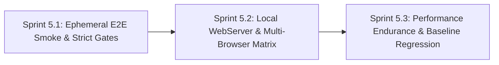

# Phase 5: Enterprise Quality Assurance, Ephemeral E2E Gates & Performance Baseline Regression

**Phase Identifier**: `PHASE-5-ENTERPRISE-QA-AND-E2E-GATES`  
**Phase Status**: Planned (Ready for Sprint 5.1 Kickoff)  
**Phase Leads**: DevOps Engineer & SDET Architect  
**Primary Personas**: DevOps Engineer, SDET Architect, QA Lead, Dev Architect, Scrum Master, Product Owner  

---

## 1. Executive Summary & Phase Theme

While **Phase 4** focused on pipeline deduplication, concurrency cancellation, and test result consolidation, **Phase 5** elevates the BuggyBooks quality assurance engineering ecosystem to enterprise-grade rigor. 

Phase 5 addresses critical blind spots in end-to-end browser testing, CI failure masking, cross-browser compatibility, developer environment decoupling, and performance degradation detection. By shifting browser smoke testing into pull request gates, eliminating `continue-on-error: true` failure suppression, introducing native local webServer orchestration, enabling WebKit/Firefox/Mobile emulation, and establishing endurance soak testing with relative baseline regression tracking, Phase 5 guarantees that no breaking visual, functional, or performance regressions can escape into production.

---

## 2. Architectural Scope & Impact

| Layer / Subsystem | Current State / Defect | Phase Target Outcome |
| :--- | :--- | :--- |
| **Pull Request E2E Smoke Gate** | PRs in `ci.yml` only execute a static POM linter (`finalize-spec.ts`). Real browser automation is never executed on pull requests, allowing UI routing, state, or checkout breaks to merge unchecked. | Implement an ephemeral Playwright `@smoke` suite (~8–10 critical journeys) in `ci.yml` Stage 3, running against local pre-built backend and frontend preview instances in < 60 seconds. |
| **CI Failure Masking & Quarantine** | `.github/workflows/playwright-ci.yml` and `playwright-docker.yml` use `continue-on-error: true`, silently marking failing test suites as green. | Remove `continue-on-error: true` so failed assertions strictly fail the workflow check; implement an `@quarantine` tag to isolate unstable tests without masking failures. |
| **Cross-Browser & Multi-Viewport Matrix** | `playwright.config.ts` only tests desktop Google Chrome. WebKit (Safari), Firefox, and mobile viewport variations are completely untested. | Implement multi-project configuration: headless Chromium + Mobile Chrome (`Pixel 5`) for PR gates; WebKit (`Desktop Safari`, `iPhone 13`) and Firefox for scheduled/nightly regression. |
| **Environment Decoupling & DX** | `env.config.ts` hardcodes external Render.com staging URLs that suffer from 50s cold starts, and tests crash if repository secrets are missing on local/fork runs. | Configure Playwright's native `webServer` for automated local lifecycle management and provide resilient fallback credentials (`testuser` / `password123`). |
| **Performance Endurance & Regression Delta** | k6 tests only execute short 10s–30s spikes against arbitrary static caps (`p95 < 250ms`). Long-term memory leaks, file descriptor starvation, and relative regressions (+20% delta) go undetected. | Author soak/endurance (15–30m) and breakpoint scenarios; add relative baseline comparison in `report-perf-summary.js` to block PRs exceeding a +20% latency regression. |

---

## 3. Sprints in this Phase

### Sprint Breakdown

1. **[Sprint 5.1: Ephemeral Playwright E2E Smoke Gate & Strict Failure Enforcement](file:///c:/BuggyBooks/buggy-books/planning/Sprints/sprint_5_1_ephemeral_e2e_smoke_and_strict_gates.md)**
   - *Estimated Effort*: 5 Story Points
   - *Key Deliverables*:
     - Addition of `e2e-smoke` job to `.github/workflows/ci.yml` running against pre-built artifacts (`dist/`).
     - Removal of `continue-on-error: true` in `playwright-ci.yml` and `playwright-docker.yml`.
     - Adoption of `@quarantine` tagging mechanism and failure artifact capture (`trace`, `screenshot`).
   - *Status*: `[PLANNED]`

2. **[Sprint 5.2: Self-Contained Local WebServer Orchestration & Multi-Browser Matrix](file:///c:/BuggyBooks/buggy-books/planning/Sprints/sprint_5_2_local_webserver_and_multi_browser_matrix.md)**
   - *Estimated Effort*: 5 Story Points
   - *Key Deliverables*:
     - Native `webServer` orchestration in `playwright.config.ts` for zero-configuration local runs.
     - Local seed credential fallbacks in `env.config.ts` (`testuser` / `password123`).
     - Cross-browser and mobile device emulation (Chromium, WebKit/Safari, Firefox, Pixel 5, iPhone 13).
   - *Status*: `[PLANNED]`

3. **[Sprint 5.3: Performance Endurance, Soak Testing & Automated Baseline Regression Detection](file:///c:/BuggyBooks/buggy-books/planning/Sprints/sprint_5_3_performance_endurance_and_baseline_regression.md)**
   - *Estimated Effort*: 5 Story Points
   - *Key Deliverables*:
     - 15–30 minute soak benchmark (`soak-load.js`) and capacity saturation benchmark (`breakpoint-test.js`).
     - Relative delta latency regression checks in `performance/report-perf-summary.js` (fail on > +20% delta).
     - Dedicated scheduled/nightly GitHub Actions workflow for long-running endurance suites.
   - *Status*: `[PLANNED]`

---

## 4. Phase 5 Acceptance Criteria & Quality Gates

- [ ] Pull requests in `ci.yml` execute a real Playwright `@smoke` suite against pre-built frontend and backend artifacts within 60 seconds.
- [ ] No occurrences of `continue-on-error: true` remain on test execution steps in any Playwright workflow.
- [ ] Failing test assertions in Playwright strictly fail the GitHub Actions workflow check while uploading failure traces.
- [ ] Known flaky tests can be quarantined with `@quarantine` without blocking active PR gates.
- [ ] Running `npx playwright test` locally requires zero pre-running server processes or external network connectivity.
- [ ] Running tests locally without repository secrets automatically resolves to seeded mock accounts without crashing.
- [ ] Playwright test suite executes across Desktop Chromium, WebKit (Safari), Firefox, and mobile viewport devices.
- [ ] k6 performance test suite includes an endurance soak scenario validating memory stability and zero file descriptor exhaustion.
- [ ] PR performance benchmarks evaluate relative delta against `main` baseline, blocking changes that introduce > 20% latency regression.

---

## 5. Risk Assessment & Rollback Strategy

- **Risk**: Ephemeral E2E smoke tests on PRs increase CI wall-clock time.
  - *Mitigation*: Run `e2e-smoke` in parallel with `lighthouse-ci` and `perf-benchmarks` in Stage 3. Constrain smoke suite to 8–10 critical journeys executed with 2 parallel workers, keeping job duration < 60 seconds.
- **Risk**: WebKit (Safari) and Firefox browser binaries increase installation overhead on CI runners.
  - *Mitigation*: Limit PR gates strictly to Chromium and Mobile Chrome (already cached). Reserve WebKit and Firefox matrices for nightly regression and post-merge runs.
- **Risk**: Removing `continue-on-error: true` might immediately block existing workflows if pre-existing tests are unstable on staging.
  - *Mitigation*: Conduct a test stability triage prior to removal, tagging any non-deterministic tests with `@quarantine` so only robust `@smoke` and `@regression` suites act as hard blockers.
