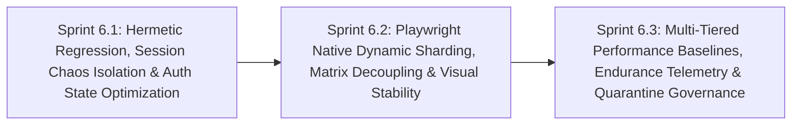

# Phase 6: Hermetic Regression Orchestration, Native Sharding & Performance Governance

**Phase Identifier**: `PHASE-6-HERMETIC-REGRESSION-SHARDING-AND-PERFORMANCE-GOVERNANCE`  
**Phase Status**: Planned (Ready for Sprint 6.1 Kickoff)  
**Phase Leads**: SDET Architect & DevOps Engineer  
**Primary Personas**: SDET Architect, DevOps Engineer, Playwright QA Specialist, Dev Architect, Scrum Master, Product Owner  

---

## 1. Executive Summary & Phase Theme

While **Phase 5** established pull request smoke gates, removed silent failure suppression, and introduced basic endurance soak benchmarks, **Phase 6** resolves systemic architectural bottlenecks and concurrency conflicts in BuggyBooks' end-to-end and performance testing ecosystems.

Phase 6 targets the root causes of regression flakiness and CI inefficiencies:
1. **Hermetic Regression Execution**: Decoupling the scheduled and nightly cross-browser regression workflows from external, shared staging environments (Render.com free-tier cold starts, rate limits) by provisioning ephemeral, containerized stacks.
2. **Session-Scoped Chaos Isolation**: Eliminating cross-test state pollution where parallel browser tests mutate global chaos configurations and wipe shared datastore state in real time.
3. **Playwright Auth State Architecture**: Introducing global storageState caching (`auth.setup.ts`) to eliminate hundreds of repetitive, fragile UI form logins across test suites.
4. **Native Dynamic Sharding**: Replacing brittle, hardcoded folder-to-shard matrices with native Playwright dynamic sharding (`--shard=1/N`) and blob report merging.
5. **Multi-Tiered Performance Baselines & Endurance Telemetry**: Aligning k6 baselines with specific test tiers (smoke vs catalog vs endurance), fixing endurance workflow syntax crashes, enforcing production benchmarking environments, and detecting memory leaks via monotonic heap drift assertions.
6. **Closed-Loop Flaky Test Governance**: Transitioning quarantined tests from a dead-end exclusion into an automated stabilization and de-quarantine lifecycle backed by universal failure trace retention.

---

## 2. Architectural Scope & Impact

| Layer / Subsystem | Current State / Defect | Phase Target Outcome |
| :--- | :--- | :--- |
| **Regression Environment & Coupling** | [playwright-ci.yml](file:///c:/BuggyBooks/buggy-books/.github/workflows/playwright-ci.yml) executes nightly cross-browser regression directly against live Render.com deployments, suffering from 50–90s cold starts, shared data mutations, and network rate limiting. | Migrate nightly regression to ephemeral containerized services (using [docker-compose.yml](file:///c:/BuggyBooks/buggy-books/docker-compose.yml) or local pre-built preview servers) ensuring 100% network and data isolation. |
| **Chaos State & Multi-User Sandboxing** | Tests calling `POST /api/test/config` ([Test_010_VisualRegressionChaos.spec.ts](file:///c:/BuggyBooks/buggy-books/playwright-e2e/src/tests/ui/VisualRegression/Test_010_VisualRegressionChaos.spec.ts)) mutate global backend state, and `POST /api/test/reset` wipes out users and carts globally while other browser jobs are running. | Enforce session-scoped chaos partitioning via `x-test-session-id` in [testController.ts](file:///c:/BuggyBooks/buggy-books/backend/src/controllers/testController.ts) and clean up sessions via `DELETE /api/test/session/:id` in [base.fixture.ts](file:///c:/BuggyBooks/buggy-books/playwright-e2e/src/core/base/base.fixture.ts). |
| **Playwright Auth Lifecycle & API Engine** | Every UI test navigates to `/login` and fills the login form manually, inflating suite runtime by 35% and causing false UI failures; API tests use Axios rather than Playwright's native `request`. | Implement `auth.setup.ts` generating `.auth/user.json` storageState for authenticated UI tests; migrate API tests to native `request: APIRequestContext` with auto-tracing. |
| **Sharding & Matrix Parallelism** | [playwright-docker.yml](file:///c:/BuggyBooks/buggy-books/.github/workflows/playwright-docker.yml) hardcodes 10 folder shards in an arbitrary JSON matrix; visual tests fail on Firefox/WebKit due to missing non-Chromium snapshots. | Replace folder matrices with Playwright native `--shard=1/N` and `@playwright/test` blob merging; scope visual regression to Chromium or engine-specific snapshots. |
| **Performance Baselines & Endurance Gating** | [perf-endurance.yml](file:///c:/BuggyBooks/buggy-books/.github/workflows/perf-endurance.yml#L94) has a syntax bug crashing report generation; 5-VU smoke tests compare against a 50-VU baseline; soak tests ignore memory leaks and run under `NODE_ENV=development`. | Fix endurance workflow export; establish tier-specific baselines (`smoke`, `catalog`, `soak`); enforce `NODE_ENV=production`; add monotonic `heapUsed` drift assertions. |
| **Flaky Test Triage & Quarantine Lifecycle** | Quarantined tests (`@quarantine`) are excluded from CI but never run on any schedule, rotting in silence; raw Playwright trace zips are omitted on regression failures. | Implement `.github/workflows/quarantine-audit.yml` with `--repeat-each=5` stabilization tracking, universal trace artifact retention, and in-PR summary reporting. |

---

## 3. Sprints in this Phase

### Sprint Breakdown

1. **[Sprint 6.1: Hermetic Regression, Session Chaos Isolation & Auth State Optimization](file:///c:/BuggyBooks/buggy-books/planning/Sprints/sprint_6_1_hermetic_regression_and_auth_optimization.md)**
   - *Estimated Effort*: 5 Story Points
   - *Key Deliverables*:
     - Ephemeral containerized service orchestration in [playwright-ci.yml](file:///c:/BuggyBooks/buggy-books/.github/workflows/playwright-ci.yml).
     - Session-scoped chaos isolation in [testController.ts](file:///c:/BuggyBooks/buggy-books/backend/src/controllers/testController.ts) via `x-test-session-id`.
     - Global Playwright `auth.setup.ts` generating `.auth/user.json` storageState.
     - Migration of API contract specs from Axios wrapper to native Playwright `request: APIRequestContext`.
   - *Status*: `[PLANNED]`

2. **[Sprint 6.2: Playwright Native Dynamic Sharding, Matrix Decoupling & Engine-Scoped Visual Regression](file:///c:/BuggyBooks/buggy-books/planning/Sprints/sprint_6_2_native_sharding_and_engine_scoped_visual_regression.md)**
   - *Estimated Effort*: 5 Story Points
   - *Key Deliverables*:
     - Dynamic sharding (`--shard=1/N`) in [playwright-docker.yml](file:///c:/BuggyBooks/buggy-books/.github/workflows/playwright-docker.yml) and [playwright-ci.yml](file:///c:/BuggyBooks/buggy-books/.github/workflows/playwright-ci.yml).
     - Playwright `@playwright/test` blob reporter and consolidated `merge-reports` workflow job.
     - Decoupling API regression tests from browser matrix into a single lightweight Node runner.
     - Engine-scoping visual regression diffs to prevent WebKit/Firefox snapshot errors.
   - *Status*: `[PLANNED]`

3. **[Sprint 6.3: Multi-Tiered Performance Baselines, Endurance Telemetry & Flaky Quarantine Governance](file:///c:/BuggyBooks/buggy-books/planning/Sprints/sprint_6_3_performance_telemetry_baselines_and_quarantine_governance.md)**
   - *Estimated Effort*: 5 Story Points
   - *Key Deliverables*:
     - Syntax fix in [perf-endurance.yml](file:///c:/BuggyBooks/buggy-books/.github/workflows/perf-endurance.yml#L94) adding `--summary-export=perf-summary-breakpoint.json`.
     - Multi-tiered golden baselines: `baseline-smoke.json` (5 VUs), `baseline-catalog.json` (50 VUs), `baseline-soak.json` (25 VUs).
     - Production benchmarking mode (`NODE_ENV=production`) and monotonic heap drift telemetry in [soak-load.js](file:///c:/BuggyBooks/buggy-books/performance/scenarios/soak-load.js).
     - Closed-loop quarantine workflow `.github/workflows/quarantine-audit.yml` and universal Playwright trace upload on failure.
   - *Status*: `[PLANNED]`

---

## 4. Phase 6 Acceptance Criteria & Quality Gates

- [ ] Nightly cross-browser Playwright regression executes against ephemeral local containers with zero dependency on external Render staging.
- [ ] Backend chaos mutations (`POST /api/test/config`) are strictly session-scoped to `x-test-session-id`, preventing state corruption in concurrent tests.
- [ ] Authenticated UI test suites consume `.auth/user.json` storageState produced by `auth.setup.ts`, bypassing repetitive UI login form submissions.
- [ ] Playwright API tests execute via native `request: APIRequestContext` and capture request/response bodies in Playwright traces.
- [ ] Docker and CI test runs use native dynamic `--shard=1/N` and merge reports via `npx playwright merge-reports`.
- [ ] Nightly cross-browser matrix runs API tests once in Node and restricts visual regression diffing to supported browser engines.
- [ ] [perf-endurance.yml](file:///c:/BuggyBooks/buggy-books/.github/workflows/perf-endurance.yml) executes breakpoint tests with `--summary-export` without JSON missing errors.
- [ ] Performance benchmarks compare against scenario-specific baselines (`smoke`, `catalog`, `soak`) under `NODE_ENV=production`.
- [ ] Soak endurance scenarios monitor Node.js `heapUsed` RSS telemetry and fail if memory drift exceeds 30%.
- [ ] Quarantined tests execute weekly via `.github/workflows/quarantine-audit.yml` with `--repeat-each=5`, tracking stabilization.
- [ ] Failed matrix runs upload raw Playwright trace zips (`test-results/`) with 7-day retention for post-mortem debugging.

---

## 5. Risk Assessment & Rollback Strategy

- **Risk**: Moving from external Render staging to local containerized staging in CI increases runner setup time.
  - *Mitigation*: Utilize pre-built Docker layers cached via GitHub Actions Cache or pre-built `dist/` preview artifacts as proven in `ci.yml`.
- **Risk**: Session-scoped chaos store changes could break legacy tests that expect global chaos defaults.
  - *Mitigation*: Maintain global fallback in `chaosStore` when `x-test-session-id` is absent, while strictly enforcing session headers in `base.fixture.ts`.
- **Risk**: StorageState reuse could cause tests to interfere with each other's user cart or order state.
  - *Mitigation*: Ensure each test creates or isolates its cart under its unique session context or uses seeded user accounts cleanly.
