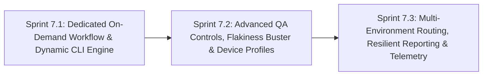

# Phase 7: On-Demand Dynamic Test Dispatch, QA Diagnostics & Multi-Environment Observability

**Phase Identifier**: `PHASE-7-ON-DEMAND-TEST-DISPATCH-AND-QA-OBSERVABILITY`  
**Phase Status**: COMPLETED 🟢 (Sprints 7.1, 7.2, and 7.3 verified live in CI)  
**Phase Leads**: SDET Architect & DevOps Engineer  
**Primary Personas**: SDET Architect, DevOps Engineer, Playwright QA Specialist, Dev Architect, Scrum Master, Product Owner  

---

## 1. Executive Summary & Phase Theme

While **Phase 6** focused on hermetic containerized regression, session-scoped chaos isolation, storageState auth caching, and native sharding, **Phase 7** bridges the gap between automated batch CI and interactive developer/QA workflows.

In high-velocity engineering environments, developers and QA engineers frequently need to:
1. **Run a single test file** or subset on-demand to verify a localized bugfix without executing the entire regression suite.
2. **Execute specific functional tags** (e.g., `@smoke`, `@regression`, `@chaos`, `@visual`) on demand.
3. **Reproduce and eradicate flaky tests** by executing suspect specs multiple times sequentially (`--repeat-each=5`) in clean CI containers.
4. **Inspect comprehensive traces** on passing or exploratory tests (`--trace on`), not merely on unexpected failures.
5. **Target live staging environments** directly, skipping local ephemeral service compilation when verifying deployments.
6. **Preserve CI stability**: Ensure that official regression pipelines ([playwright-ci.yml](file:///c:/BuggyBooks/buggy-books/.github/workflows/playwright-ci.yml)) remain immutable and protected, while on-demand test runs execute through a dedicated, isolated workflow ([playwright-on-demand.yml](file:///c:/BuggyBooks/buggy-books/.github/workflows/playwright-on-demand.yml)).

---

## 2. Architectural Scope & Impact

| Layer / Subsystem | Current State / Constraint | Phase Target Outcome |
| :--- | :--- | :--- |
| **Workflow Decoupling** | [playwright-ci.yml](file:///c:/BuggyBooks/buggy-books/.github/workflows/playwright-ci.yml) combines scheduled nightly regression, downstream CI completion triggers, and basic manual triggers. Manual runs force execution of all tests across both API and UI suites. | Create a dedicated workflow [playwright-on-demand.yml](file:///c:/BuggyBooks/buggy-books/.github/workflows/playwright-on-demand.yml) for ad-hoc QA dispatch without modifying or risking regressions in `playwright-ci.yml`. |
| **Test Targeting & Tag Filtering** | All tests in `src/tests/api` and `src/tests/ui` are unconditionally executed. Testing a single spec requires running all 40+ tests. | Support dynamic path targeting (`test_path`), suite scoping (`test_scope`), tag filtering (`tag` e.g., `@smoke`), test title regex (`grep`), and exclusions (`exclude_tag`). |
| **Flakiness Triage & Retries** | Retries are hardcoded to `retries: 1`. Flakiness verification requires local execution or manual code changes. | Introduce native `--repeat-each <N>`, dynamic `retries` override (`0` for instant fail-fast, `1`, `2`), and `--fail-fast` (`-x`) stopping on first failure. |
| **Observability & Tracing** | Traces are strictly `retain-on-failure`. Passing or intermittently passing tests leave no DOM snapshot or network traces for inspection. | Add configurable `trace_mode` (`retain-on-failure` vs `on`) to capture full trace recordings on demand for deep forensic analysis. |
| **Device & Browser Emulation** | UI execution is locked to Desktop Chromium. Mobile and alternative browser tests require local execution. | Expose project selection (`project`: `chromium`, `firefox`, `webkit`, `mobile-chrome`, `mobile-safari`) with automated dependency installation. |
| **Multi-Environment Routing** | Runs always build backend & frontend ephemeral preview servers, taking 2–3 minutes even when testing remote deployments. | Support `target_env: LOCAL` (default, ephemeral stack) vs `STAGING` (instant execution against live deployment, skipping builds). |
| **Report Hygiene & Governance** | Every run automatically deploys to GitHub Pages `AutomationReports/CI/${run_number}`, cluttering release history with ad-hoc experiments. | Provide a `publish_report` toggle (`true`/`false`) allowing downloadable artifacts without polluting permanent GitHub Pages history. |

---

## 3. Sprints in this Phase

### Sprint Breakdown

1. **[Sprint 7.1: Dedicated On-Demand Workflow & Dynamic CLI Engine](file:///c:/BuggyBooks/buggy-books/planning/Sprints/sprint_7_1_on_demand_workflow_and_dynamic_cli_engine.md)**
   - *Estimated Effort*: 4 Story Points
   - *Key Deliverables*:
     - Dedicated `.github/workflows/playwright-on-demand.yml` workflow preserving `playwright-ci.yml` untouched.
     - Inputs for `test_scope` (`all`, `ui`, `api`), `tag` (`@smoke`, `@regression`, etc.), `test_path` (file or directory), and `grep` (title regex).
     - Bash array-based CLI argument builder with injection safety, tag prefix normalization (`smoke` -> `@smoke`), and `--pass-with-no-tests` zero-match protection.
     - Preservation of default full-suite execution when triggered without overrides.
   - *Status*: `[COMPLETED]`

2. **[Sprint 7.2: Advanced QA Controls, Flakiness Buster & Device Profiles](file:///c:/BuggyBooks/buggy-books/planning/Sprints/sprint_7_2_advanced_qa_controls_flakiness_buster_and_cross_browser.md)**
   - *Estimated Effort*: 5 Story Points
   - *Key Deliverables*:
     - Flakiness buster: `repeat_each` input (`1`, `3`, `5`, `10`) for localized stress-testing.
     - Fast-feedback debugging: `retries` override (`0`, `1`, `2`) and `fail_fast` (`-x` / `--max-failures=1`).
     - Negative filtering: `exclude_tag` / `grep_invert` to omit unwanted suites (e.g., exclude `@chaos`).
     - Deep forensics: `trace_mode` toggle (`retain-on-failure` vs `on` for full DOM snapshot capture).
     - Browser and viewport profiling: `project` choice (`chromium`, `firefox`, `webkit`, `mobile-chrome`, `mobile-safari`).
   - *Status*: `[COMPLETED]` 🟢 (Runs: 34039925580, 34040480692, 34040731171, 34040973888)

3. **[Sprint 7.3: Multi-Environment Routing, Resilient Reporting & Telemetry](file:///c:/BuggyBooks/buggy-books/planning/Sprints/sprint_7_3_multi_env_dispatch_resilient_reporting_and_governance.md)**
   - *Estimated Effort*: 4 Story Points
   - *Key Deliverables*:
     - Multi-environment dispatch: `target_env: LOCAL` (ephemeral stack) vs `STAGING`/`INTEROP` (skips compilation).
     - Report hygiene: `publish_report` boolean controlling GitHub Pages deployment vs artifact-only storage.
     - Partial-suite blob report merging resilience and zero-blob fallback handling.
     - Comprehensive GitHub Actions Step Summary documenting all active dispatch parameters and runtime metrics.
   - *Status*: `[COMPLETED]` 🟢 (Runs: 34041530450, 34041540403)

---

## 4. Phase Definition of Done & Live Verification Gate

Before closing Phase 7, the following live verification gates must be satisfied via actual GitHub Actions workflow dispatch runs (`gh workflow run`):

1. **Trigger & Passing Status Verification**:
   - Every on-demand permutation (smoke suite, targeted single spec, default full suite, cross-browser, and staging) must be triggered via `gh workflow run playwright-on-demand.yml`.
   - Each triggered run must execute to completion and finish with `conclusion: success`.
2. **Selective Execution Precision**:
   - Verify in step execution logs that targeting `test_path` or `tag` only runs the requested tests and skips unselected suites.
3. **Comprehensive Report Validation**:
   - Download consolidated HTML reports via `gh run download` and verify complete rendering of test steps, assertions, and metadata.
   - Verify Allure report generation and deployment to GitHub Pages (when enabled) without blob merge errors.
   - Verify GitHub Actions `$GITHUB_STEP_SUMMARY` displays high-visibility diagnostics with passing/failing tables and active dispatch inputs.
4. **Zero-Regression Baseline**:
   - Confirm [playwright-ci.yml](file:///c:/BuggyBooks/buggy-books/.github/workflows/playwright-ci.yml) remains 100% untouched and passes its scheduled and PR runs independently.
