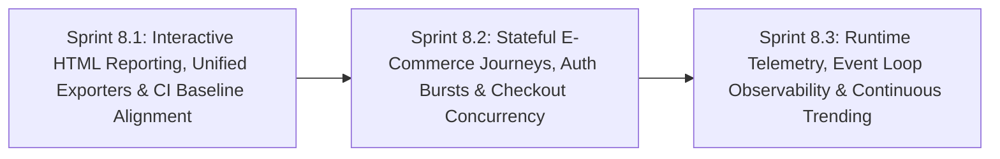

# Phase 8: Advanced Performance Engineering, Interactive Visual Reporting & Runtime Observability

**Phase Identifier**: `PHASE-8-ADVANCED-PERFORMANCE-ENGINEERING-VISUAL-REPORTING-AND-RUNTIME-OBSERVABILITY`  
**Phase Status**: Planned (Ready for Sprint 8.1 Kickoff)  
**Phase Leads**: SDET Architect & Performance DevOps Engineer  
**Primary Personas**: SDET Architect, Performance DevOps Engineer, Backend Architect, QA Performance Specialist, Scrum Master, Product Owner  

---

## 1. Executive Summary & Phase Theme

While **Phase 6** introduced baseline regression gates and endurance soak tests, and **Phase 7** established on-demand test dispatch controls, BuggyBooks' performance testing ecosystem currently lacks **visual observability, comprehensive user journey coverage, CI baseline consistency, and server-side runtime telemetry**.

Currently, k6 performance tests execute in headless obscurity:
1. **Zero Visual / HTML Reporting**: Results exist strictly as raw, unformatted `.json` files and plain markdown tables appended into terminal logs and GitHub Actions step summaries. There are no standalone HTML dashboards, latency distribution curves ($p50, p90, p95, p99$), throughput timelines, or shareable visual artifacts.
2. **Read-Only API Blind Spots**: 100% of current tests ([smoke-load.js](file:///c:/BuggyBooks/buggy-books/performance/k6/smoke-load.js), [catalog-load.js](file:///c:/BuggyBooks/buggy-books/performance/k6/catalog-load.js), [soak-load.js](file:///c:/BuggyBooks/buggy-books/performance/scenarios/soak-load.js), [breakpoint-test.js](file:///c:/BuggyBooks/buggy-books/performance/scenarios/breakpoint-test.js)) only query three read-only GET endpoints (`/api/books`, `/api/books?q=...`, `/api/books/1`). High-CPU operations (`POST /api/login` bcrypt hashing), stateful mutations (`POST /api/cart`), and transactional write bottlenecks (`POST /api/checkout/process` inventory locking) are never load tested.
3. **CI Pipeline Inconsistencies & Hardcoded Keys**: In [ci.yml](file:///c:/BuggyBooks/buggy-books/.github/workflows/ci.yml#L362), `inventory-stress.js` is evaluated against `baseline-catalog.json`, and [report-perf-summary.js](file:///c:/BuggyBooks/buggy-books/performance/report-perf-summary.js) only parses hardcoded catalog metrics, leaving inventory degradations unmonitored.
4. **Lack of Continuous Historical Trending**: Baselines are static git-committed snapshots. There is no historical tracking across builds, allowing creeping regressions (e.g. $+2\%$ per PR) to accumulate undetected without triggering the $+20\%$ single-run threshold.
5. **Absence of Server-Side Diagnostic Telemetry**: Tests measure client-side latency without measuring server health. Engineers cannot correlate response-time degradation with Node.js Event Loop Lag, libuv active handles, CPU saturation, or garbage collection pauses.

**Phase 8** transforms BuggyBooks from basic load testing into an enterprise-grade performance engineering ecosystem with interactive UI dashboards, stateful e-commerce user journeys, automated historical trending, and deep Node.js runtime observability.

---

## 2. Architectural Scope & Impact

| Layer / Subsystem | Current State / Constraint | Phase Target Outcome |
| :--- | :--- | :--- |
| **Performance Reporting & UI** | Raw `perf-summary-*.json` and flat text tables in `$GITHUB_STEP_SUMMARY`. Zero standalone HTML dashboards or graphical percentile curves. | Implement a standalone, interactive HTML performance dashboard (`performance/report.html`) with response time distribution curves, RPS throughput graphs, error timelines, and baseline comparison cards. |
| **Workload & User Journeys** | Tests strictly exercise read-only `GET /api/books` queries. Zero write operations, auth bursts, or checkout concurrency are tested. | Author realistic multi-step e-commerce journey scenarios (`scenarios/ecommerce-journey.js`) simulating weighted user behaviors (Browse, Search, Login, Add to Cart, Checkout) under concurrency. |
| **CI Baseline Governance** | [ci.yml](file:///c:/BuggyBooks/buggy-books/.github/workflows/ci.yml) evaluates inventory stress against catalog baseline; [report-perf-summary.js](file:///c:/BuggyBooks/buggy-books/performance/report-perf-summary.js) hardcodes metrics; summary exporters are inconsistent. | Create `baseline-inventory.json`, dynamically compare all custom Trend metrics, unify `handleSummary(data)` across all k6 scripts, and auto-rotate `k6-summary.md`. |
| **Continuous Historical Trending** | Baselines are static single-point-in-time JSON files; creeping $+2\%$ degradations across consecutive PRs remain invisible. | Implement historical telemetry tracking (`perf-history.json`) via GitHub Actions Cache, rendering multi-build latency sparklines and automated baseline recalibration workflows. |
| **Node.js Runtime Observability** | The backend server is spawned blindly; only soak tests poll basic memory. No insight into Event Loop lag, CPU usage, or GC pauses. | Instrument `/api/health` and `/api/metrics` with `perf_hooks.monitorEventLoopDelay()`, active handle counts, and CPU metrics; visualize server vitals in the performance dashboard. |

---

## 3. Sprints in this Phase

### Sprint Breakdown

1. **[Sprint 8.1: Interactive HTML Reporting, Unified Exporters & CI Baseline Alignment](file:///c:/BuggyBooks/buggy-books/planning/Sprints/sprint_8_1_interactive_html_reporting_and_baseline_governance.md)**
   - *Estimated Effort*: 5 Story Points
   - *Key Deliverables*:
     - Standalone, interactive HTML/SVG performance report generator producing `performance/report.html` with responsive charts, percentile graphs, and threshold cards.
     - Universal `performance/utils/summary-handler.js` unifying `handleSummary(data)` across all k6 scripts for both JSON and HTML outputs.
     - Dedicated [baseline-inventory.json](file:///c:/BuggyBooks/buggy-books/performance/baselines/baseline-inventory.json) and fix for [ci.yml](file:///c:/BuggyBooks/buggy-books/.github/workflows/ci.yml#L362) baseline alignment.
     - Dynamic metric discovery in [report-perf-summary.js](file:///c:/BuggyBooks/buggy-books/performance/report-perf-summary.js) removing hardcoded metric keys.
     - Report artifact publishing in [ci.yml](file:///c:/BuggyBooks/buggy-books/.github/workflows/ci.yml) and [perf-endurance.yml](file:///c:/BuggyBooks/buggy-books/.github/workflows/perf-endurance.yml).
   - *Status*: `[PLANNED]`

2. **[Sprint 8.2: Stateful E-Commerce Journeys, Auth Bursts & Checkout Concurrency](file:///c:/BuggyBooks/buggy-books/planning/Sprints/sprint_8_2_stateful_ecommerce_journeys_and_concurrency_stress.md)**
   - *Estimated Effort*: 5 Story Points
   - *Key Deliverables*:
     - Multi-scenario user journey test (`performance/scenarios/ecommerce-journey.js`) with probabilistic behavior distribution (60% browse, 20% search, 10% cart, 5% checkout, 5% auth).
     - Authentication burst benchmark (`performance/k6/auth-stress.js`) stress-testing `POST /api/login` bcrypt hashing and JWT token issuance.
     - High-concurrency checkout race condition benchmark (`performance/k6/checkout-stress.js`) validating inventory lock contention under load.
     - New golden baselines: `baseline-journey.json`, `baseline-auth.json`, and `baseline-checkout.json`.
     - NPM script bindings in `performance/package.json` for all new test suites.
   - *Status*: `[PLANNED]`

3. **[Sprint 8.3: Runtime Telemetry, Event Loop Observability & Continuous Trending](file:///c:/BuggyBooks/buggy-books/planning/Sprints/sprint_8_3_runtime_telemetry_event_loop_and_historical_trending.md)**
   - *Estimated Effort*: 5 Story Points
   - *Key Deliverables*:
     - Backend instrumentation: `perf_hooks.monitorEventLoopDelay()`, active libuv handle counting, and process CPU calculation exposed on `GET /api/health`.
     - Real-time Node.js diagnostics polling in k6 soak and breakpoint tests correlating server health with client latencies.
     - Historical performance time-series tracking (`perf-history.json`) via GitHub Actions Cache to detect multi-PR creeping regressions.
     - Historical sparkline graphs rendered in PR Step Summaries and the performance HTML dashboard.
     - Automated baseline recalibration workflow (`.github/workflows/perf-baseline-recalibrate.yml`) triggered on `workflow_dispatch`.
   - *Status*: `[PLANNED]`

---

## 4. Phase Definition of Done & Quality Gates

Before closing Phase 8, the following criteria must be validated:

1. **HTML & Visual UI Validation**:
   - Every k6 test run (smoke, catalog, inventory, soak, breakpoint, journey) produces a standalone, self-contained `report.html`.
   - The HTML report opens in standard browsers without external CDN dependencies, rendering interactive charts (p50/p90/p95/p99 percentiles, throughput RPS, error breakdowns, and baseline delta badges).
   - [ci.yml](file:///c:/BuggyBooks/buggy-books/.github/workflows/ci.yml) and [perf-endurance.yml](file:///c:/BuggyBooks/buggy-books/.github/workflows/perf-endurance.yml) successfully upload `performance-html-report` artifacts.
2. **Stateful Workload Verification**:
   - `ecommerce-journey.js` successfully creates auth tokens, adds items to carts, and processes checkouts concurrently with zero unhandled promise rejections.
   - Auth stress testing benchmarks CPU saturation under concurrent bcrypt verification.
   - Concurrent checkout stress confirms inventory consistency and verifies transactional resilience.
3. **CI Baseline Integrity**:
   - `inventory-stress.js` compares against `baseline-inventory.json` with correct metric tracking (`inventory_duration`).
   - Dynamic metric parsing in [report-perf-summary.js](file:///c:/BuggyBooks/buggy-books/performance/report-perf-summary.js) detects any $+20\%$ regression across all custom Trend metrics.
4. **Server Diagnostics & Historical Tracking**:
   - Node.js Event Loop Lag and CPU usage are captured and visualized side-by-side with response times.
   - Continuous historical trend data records the last 20 CI runs, alerting on creeping degradation trends.

---

## 5. Risk Assessment & Rollback Strategy

- **Risk**: Generating HTML reports within k6 execution could add memory overhead during high-VU load tests.
  - *Mitigation*: Generate the HTML report in post-processing inside [report-perf-summary.js](file:///c:/BuggyBooks/buggy-books/performance/report-perf-summary.js) using the exported summary JSON, keeping k6 engine memory footprint completely unaffected.
- **Risk**: High-concurrency checkout tests might exhaust seeded database stock, causing false failure cascades.
  - *Mitigation*: Leverage session-scoped isolation or pre-seed dedicated test book inventories in `setup()` and reset via `/api/test/reset` in `teardown()`.
- **Risk**: Historical cache corruption in GitHub Actions could cause trend chart parsing errors.
  - *Mitigation*: Ensure robust fallback to empty history and automatic schema migration when reading `perf-history.json`.
