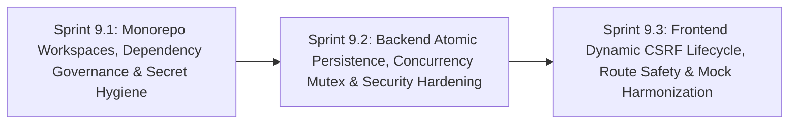

# Phase 9: Full-Stack Quality Hardening, Monorepo Workspaces & System Resilience

**Phase Identifier**: `PHASE-9-FULL-STACK-QUALITY-HARDENING-MONOREPO-WORKSPACES-AND-SYSTEM-RESILIENCE`  
**Phase Status**: Planned (Ready for Backlog Grooming & Sprint Execution)  
**Phase Leads**: Full-Stack Architect & DevOps / Quality Lead  
**Primary Personas**: Full-Stack Architect, Backend Specialist, Frontend Specialist, DevOps Engineer, Security Champion, Scrum Master  

---

## 1. Executive Summary & Phase Theme

Following the extensive quality audit across the BuggyBooks monorepo, **Phase 9** targets foundational code quality, system robustness, dependency governance, and operational security across the core application stack (Monorepo, Backend API, and Frontend Web Client).

While BuggyBooks successfully implements an impressive set of intentional bugs and chaos features for testing, critical architectural anti-patterns in the core foundation risk stability, security, and developer velocity:
1. **Un-orchestrated Monorepo & Leaked Credentials**: Packages operate in decoupled silos using fragile OS-dependent chained shell commands (`cd backend && npm ...`). Worse, valid JWT authentication state ([auth-state.json](file:///c:/BuggyBooks/buggy-books/auth-state.json)) was committed directly to Git at the repository root.
2. **File Persistence Race Conditions & Windows File Locks**: The backend's file-based storage relies on `fs.promises.rename`, which regularly throws `EPERM` and `EBUSY` exceptions under concurrency on Windows, coupled with an unmanaged save queue that drops intermediate writes.
3. **Multi-Tenant CORS Wildcard Vulnerability**: A permissive regular expression in CORS configuration allows arbitrary subdomains on `onrender.com` to make credentialed requests to the backend API.
4. **Stale Frontend CSRF Token Caching & Abrupt SPA Navigation**: The frontend stores CSRF tokens in a global module variable that never synchronizes with session renewal, and falls back to hard `window.location.href` redirects that disrupt React state and break Vitest component tests.
5. **Conflicting Test Mocking Layers**: The frontend tests mix crude string-matching global `fetch` overrides with MSW, resulting in inconsistent component test behavior.

**Phase 9** resolves all of these core structural defects, establishing an enterprise-grade monorepo workspace, an atomic and thread-safe persistence layer, an airtight CORS policy, and a resilient frontend networking and testing architecture.

---

## 2. Architectural Scope & Target Outcomes

| Subsystem | Current State / Constraint | Phase Target Outcome |
| :--- | :--- | :--- |
| **Monorepo Architecture** | Raw `package.json` with chained `cd ... && npm ...` scripts; `performance/` package omitted from `install:all`; conflicting lockfiles and dependencies. | Implement native **npm workspaces** (`workspaces: ["backend", "frontend", "playwright-e2e", "performance", "shared"]`), unified scripts, and clean package orchestration. |
| **Secret & Artifact Hygiene** | `auth-state.json` with active JWT tokens committed to Git; root directory polluted by scattered performance summaries, HTML reports, and test DBs; ESLint scanning coverage files. | Purge `auth-state.json` from git history; redirect test auth state to `.auth/`; update `.gitignore` and ESLint `globalIgnores` to eliminate all repo dirt and linter warnings. |
| **Backend Persistence & Concurrency** | `fs.promises.rename` causes `EPERM`/`EBUSY` file locking errors on Windows; single-slot `pendingWrite` drops intermediate mutations under load. | Implement safe atomic write strategy (write-then-copy fallback with retry mutex) and sequential FIFO write queue preventing data loss. |
| **Backend Security & Lifecycle** | CORS wildcard `/^([a-z0-9-]+\.)*onrender\.com$/` permits arbitrary tenant origins; un-refed 8-second interval in `server.ts` prevents clean Jest and process exit. | Strict origin whitelist restricting access to verified domains; call `.unref()` on simulation timer; add LRU bounds to in-memory session store. |
| **Frontend CSRF & Routing** | `csrfToken` cached globally forever without refresh on 403; `window.location.href = '/login'` disrupts React Router and breaks tests. | Dynamic CSRF lifecycle with automatic 1-time re-fetch and retry; non-destructive React Router navigation callbacks in `AuthContext`. |
| **Frontend Test Mocking** | Competing `globalThis.fetch` override in `setupTests.ts` and MSW handlers in `msw-api-mocking.test.tsx`. | Consolidate all frontend component and unit tests on MSW (`mocks/handlers.ts`), removing brittle fetch string matching. |

---

## 3. Sprints in this Phase

### Sprint Breakdown

1. **[Sprint 9.1: Monorepo Workspaces, Dependency Governance & Secret Hygiene](file:///c:/BuggyBooks/buggy-books/planning/Sprints/sprint_9_1_monorepo_workspaces_dependency_governance_and_secret_hygiene.md)**
   - *Estimated Effort*: 5 Story Points
   - *Key Deliverables*:
     - Root `package.json` converted to native npm workspaces encompassing all 5 packages.
     - Deprecation of fragile chained `cd` commands in favor of standard workspace scripts.
     - Git purge and removal of [auth-state.json](file:///c:/BuggyBooks/buggy-books/auth-state.json), redirecting Playwright auth state to `.auth/`.
     - Repository cleanup and `.gitignore` standardization for test summaries and reports.
     - Frontend ESLint `globalIgnores` update to exclude `coverage/` files.

2. **[Sprint 9.2: Backend Atomic Persistence, Concurrency Mutex & Security Hardening](file:///c:/BuggyBooks/buggy-books/planning/Sprints/sprint_9_2_backend_atomic_persistence_concurrency_mutex_and_security_hardening.md)**
   - *Estimated Effort*: 5 Story Points
   - *Key Deliverables*:
     - Safe atomic file-writing utility in [storage.ts](file:///c:/BuggyBooks/buggy-books/backend/src/data/storage.ts) eliminating Windows `EPERM`/`EBUSY` exceptions.
     - Mutex-backed sequential write queue ensuring no dropped database writes under high concurrency.
     - Strict CORS whitelist in [app.ts](file:///c:/BuggyBooks/buggy-books/backend/src/app.ts), closing the multi-tenant `*.onrender.com` wildcard exploit.
     - Process lifecycle fix in [server.ts](file:///c:/BuggyBooks/buggy-books/backend/src/server.ts) (`.unref()` on simulation interval).
     - Bound in-memory session cache capacity in `SessionStorageManager`.

3. **[Sprint 9.3: Frontend Dynamic CSRF Lifecycle, Route Safety & Mock Harmonization](file:///c:/BuggyBooks/buggy-books/planning/Sprints/sprint_9_3_frontend_dynamic_csrf_route_safety_and_mock_harmonization.md)**
   - *Estimated Effort*: 5 Story Points
   - *Key Deliverables*:
     - Self-healing CSRF token lifecycle in [frontend/src/api.ts](file:///c:/BuggyBooks/buggy-books/frontend/src/api.ts) with auto-fetch and retry on 403.
     - Graceful React Router navigation replacing raw `window.location.href` redirects.
     - Migration of component tests to MSW, deprecating crude `globalThis.fetch` mocks in `setupTests.ts`.
     - Baseline accessibility landmark roles for `<order-summary-box>` Web Component in [OrderSummary.tsx](file:///c:/BuggyBooks/buggy-books/frontend/src/components/OrderSummary.tsx).

---

## 4. Definition of Done for Phase 9

- [ ] `npm install` at root installs all 5 workspaces seamlessly across Windows, Linux, and macOS.
- [ ] `npm run lint` and `npm run typecheck` execute cleanly with 0 errors and 0 warnings across all workspaces.
- [ ] `auth-state.json` is untracked and absent from git history.
- [ ] Backend storage tests pass without Windows `EPERM`/`EBUSY` errors under 50 concurrent writes.
- [ ] Security scan confirms unauthorized CORS requests from `https://attacker.onrender.com` are blocked.
- [ ] Frontend tests execute with MSW without unhandled route redirects or global fetch mock conflicts.
- [ ] All 12 backend test suites (85 tests) and 10 frontend test suites (32 tests) pass with 100% green status.
